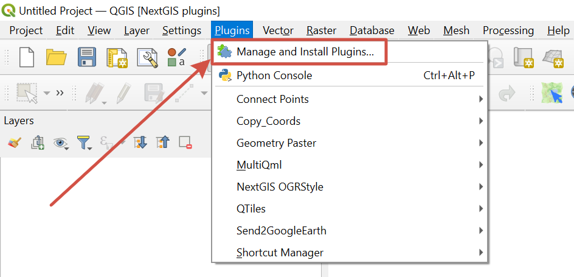
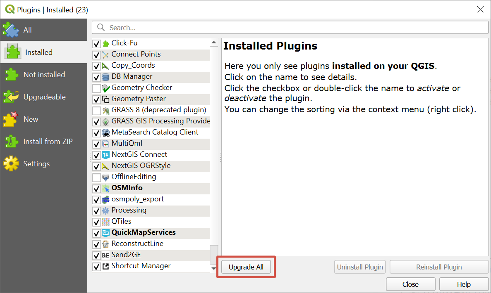

Update plugins
================

Open QGIS and in the menu bar select ``Plugins ‣ Manage and install plugins``.

   Selecting plugin manager

Go to the *Installed* tab.
Plugins that have updates available are marked **in bold**.

   Managing plugins

To install all available updates, press **Upgrade all**.
Make sure that the plugins are activated (ticked).
