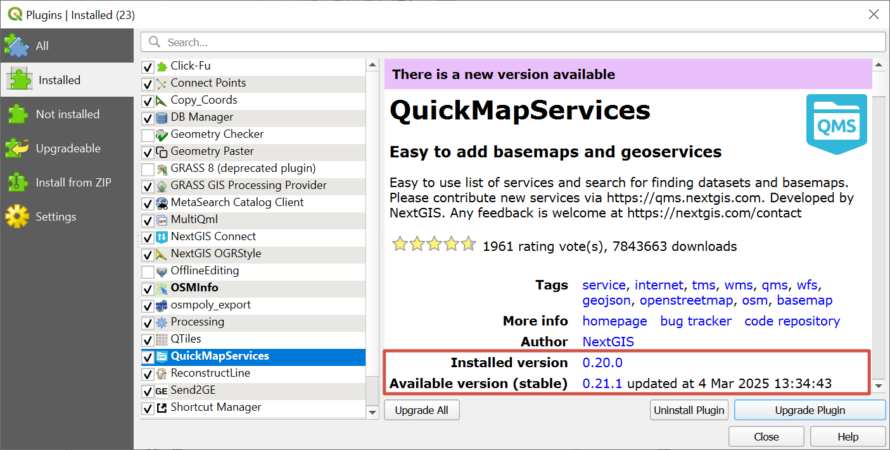

Update plugins
================

Open QGIS and in the menu bar select ``Plugins ‣ Manage and install plugins``.

.. figure:: _static/ngq_plugins_manage_open_en.png
   :name: ngq_plugins_manage_open_pic
   :align: center
   :width: 17cm

   Selecting plugin manager

Go to the *Installed* tab.
Plugins that have updates available are marked **in bold**.

.. figure:: _static/ngq_manage_plugins_en.png
   :name: ngq_manage_plugins_pic
   :align: center
   :width: 20cm

   Managing plugins

To install all available updates, press **Upgrade all**.
Make sure that the plugins are activated (ticked).

Check installed verison of a plugin
-------------------------------------

Open QGIS and in the menu bar select ``Plugins ‣ Manage and install plugins``.

Go to the *Installed* tab. Click on the plugin in the list or star typing its name in the search bar and select the plugin from the search results.

On the right you'll find the plugin information.

   Checking plugin version

In the About panel you'll find Installed verison and Available version (stable) with date and time of its release. Also, if an update is available, there will be a message at the top of the panel.
