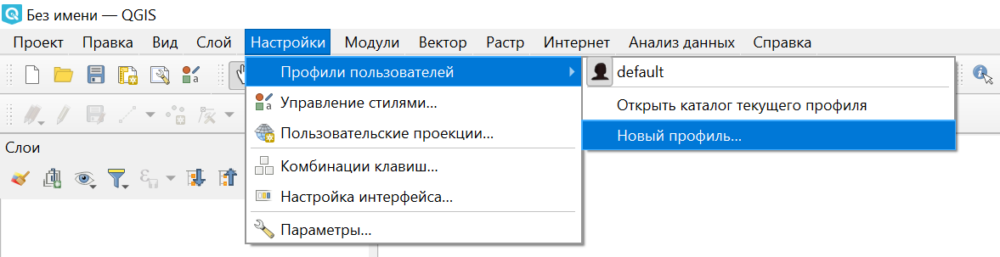
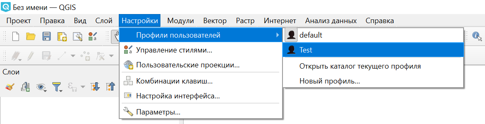
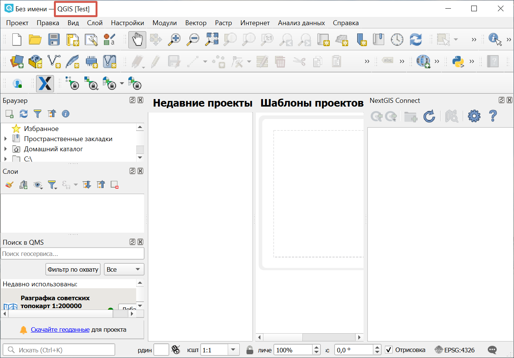
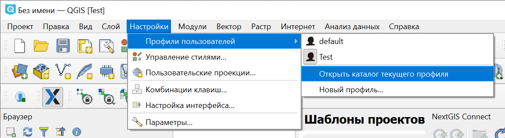
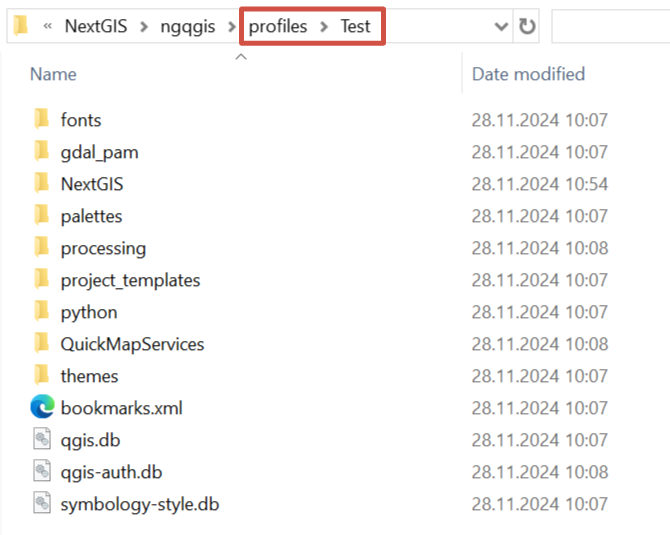
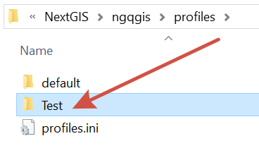

Профили пользователей
============================

QGIS позволяет сохранять пользовательские настройки в виде профилей и переключаться между ними. Таким образом можно иметь готовые наборы панелей, плагинов и инструментов для разных задач и быстро переключаться между ними, не тратя время на перенастройку QGIS.

При первой установке QGIS создаётся профиль по умолчанию. Его настройки сохраняются при обновлении приложения.

В связи с этим при появлении сбоев в работе QGIS рекомендуется не переустанавливать приложение, а создать новый профиль пользователя. Новый профиль создаётся "чистым", как если бы QGIS был только что установлен.

Профили можно копировать с устройства на устройство, чтобы пользоваться одним набором настроек на разных машинах.

.. _ngq_profile_contents:

Что хранится в профиле
-----------------------

* глобальные параметры, в том числе локализация, проекции, настройки аутентификации, цветовые палитры, "горячие клавиши";
* конфигурация пользовательского интерфейса (включённые панели инструментов, расположение панелей в рабочем пространстве и т.п.);
* установленные модули и их настройки;
* шаблоны проектов и история сохранённых проектов с их превью;
* настройки инструментов анализа, скрипты, модели, журнал отладочных сообщений.

.. to do:: https://docs.qgis.org/3.10/en/docs/user_manual/introduction/qgis_configuration.html#working-with-user-profiles

.. _ngq_profile_create:

Создание профиля
-----------------

Чтобы создать новый профиль, из верхнего меню выберите Настройки ‣ Профили пользователей ‣ Новый профиль.

Во всплывающем окне задайте имя для нового профиля. Откроется новое окно QGIS с именем пользователя в квадратных скобках. В нём вы можете произвести необходимые настройки.

.. note:: Имя профиля не должно содержать специальных символов, кроме нижнего подчёркивания. Регистр не учитывается.

.. _ngq_profile_switch:

Переключение между профилями
-----------------------------

Чтобы переключиться на другой профиль, из верхнего меню откройте Настройки ‣ Профили пользователей и выберите нужный профиль из списка.

Откроется новое окно QGIS с настройками соответствующего профиля.

.. _ngq_profile_del:

Удаление профиля
-----------------

Чтобы удалить профиль, зайдите в Настройки ‣ Профили пользователей ‣ Открыть каталог текущего профиля. Откроется окно проводника с каталогом. 

   Открытие каталога текущего профиля

   Каталог профиля

Закройте QGIS. В проводнике перейдите на уровень выше и удалите папку с именем профиля. При следующей загрузке QGIS его не будет в списке профилей.

   Папка, в которой хранятся каталоги профилей

.. _ngq_profile_param:

Параметры профиля
---------------------

Во вкладке "Профили" меню "Параметры" можно выбрать, какой профиль будет активен при открытии QGIS.

* Последний закрытый - Если было открыто несколько окон QGIS с разными профилями, будет запомнен тот, который закрыли последним;
* Всегда использовать профиль ... - Указывается конкретный профиль из списка созданных;
* Выбирать при открытии - Каждый раз при открытии программы будет появляться диалог выбора профиля пользователя.

Размер иконок, отображаемых в диалоговом окне выбора пользователя, можно выбрать в следующей настройке.

Также здесь можно настроить иконку текущего профиля (его название будет указано в скобках). Для этого нажмите на изображение и выберите файл на устройстве, который хотите использовать в качестве иконки. Чтобы вернуть стандартную иконку, нажмите на кнопку с двумя стрелочками справа.

Другой способ установить профиль, с которым будет открываться программа - отредактировать файл profiles.ini. Он находится уровнем выше каталога профиля, в директории profiles. Этот файл можно открыть обычным блокнотом и вписать название нужного профиля в строку ``defaultProfile=``, например:

.. code-block::

   [core]
   defaultProfile=MyProfile
   selectionPolicy=0
   lastProfile=default

Здесь же вы можете посмотреть, какой профиль был закрыт последним.
