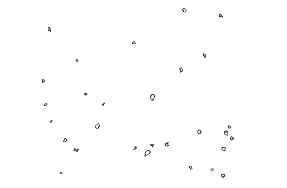
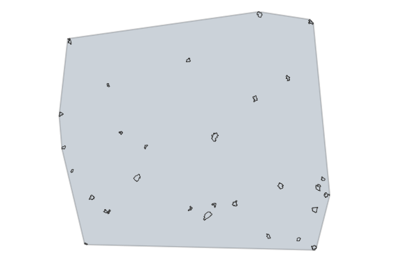
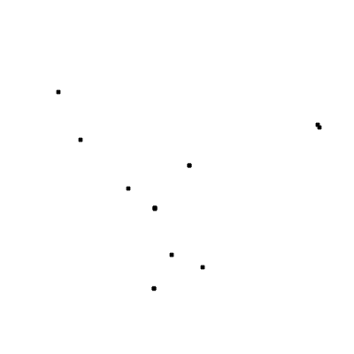
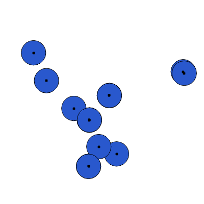
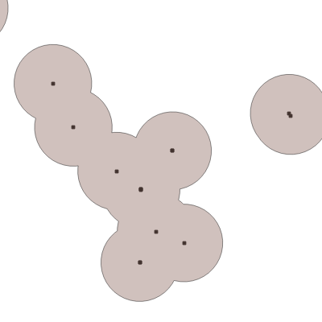

.. sectionauthor:: Дмитрий Барышников <dmitry.baryshnikov@nextgis.ru>

.. _ngq_vector_op:

Работа с векторными данными
===========================

QGIS использует библиотеку OGR для чтения и записи векторных данных (работа с векторными
данными GRASS и данными PostgreSQL реализована через отдельные модули поставщиков 
данных), включая ESRI shape-файлы, файлы MapInfo и Microstation, пространственные 
базы PostGIS, SpatiaLite, Oracle и многие другие. Кроме того, векторные данные могут 
быть загруженны напрямую из архивов zip или gzip. С полным списком форматов векторных 
данных можно ознакомиться по адресу: http://www.gdal.org/ogr/ogr_formats.html .

Перечисленные операции выполняются модулем fTools. По умолчанию он установлен. 
Если вы не находите этих пунктов в меню, установите и включите этот модуль.

Анализ
------

Эти инструменты работают с векторными слоями. Как правило они создают новый Shapefile. 
Они требуют, чтобы входные слои были в одинаковой системе координат. Если инструмент 
рассчитывает расстояние, то ожидается, что слои будут в таких системах координат, 
где расстояния измеряются в метрах, например UTM.  См. так же раздел :ref:`ngq_projections`.

Матрица расстояний
^^^^^^^^^^^^^^^^^^^^^

Измеряет расстояние между точками двух точечных слоёв и выдает результат в виде:

1. Квадратной матрицы расстояний. 
2. Линейной матрицы расстояний. 
3. Суммы расстояний. 

Можно ограничить расчет только для k ближайших точек. Создаёт таблицу в формате CSV.

Сумма расстояний
^^^^^^^^^^^^^^^^^^^^^
Сумма расстояний в полигонах.

Рассчитывает сумму расстояний для линий линейного слоя в пределах каждого полигона 
другого (векторного полигонального) слоя. Создаёт новый полигональный Shapefile 
с добавленным полем.

Например, есть полигональный слой территорий городов и линейный слой рек. Для каждого 
города будет рассчитана суммарная длинна рек на его территории. 

Количество точек в полигонах
^^^^^^^^^^^^^^^^^^^^^^^^^^^^^^^^^^^^^^^^^^

Рассчитывает число точек точечного слоя, которые находятся в пределах каждого полигона 
другого (векторного полигонального) слоя.
Имеется возможность выбрать статистический метод объединения атрибутов, если в точечном 
слое есть числовые атрибуты. Создаёт новый полигональный Shapefile с добавленным полем.

Пример: есть полигональный слой территорий городов и точечный слой железнодорожных 
станций. Для каждого города будет рассчитано количество находящихся в нём железнодорожных 
станций. 

Пример: есть полигональный слой районов города и точечный слой заведений общественного 
питания с количеством посадочных мест. Для каждого района будет добавленно два атрибута: 
количество находящихся в нём заведений общественного питания и сумма всех посадочных 
мест в районе или среднее число посадочных мест в этом районе. 

Список уникальных значений
^^^^^^^^^^^^^^^^^^^^^^^^^^^^^^^^^^^^^^^^^^

Задаётся векторный слой и поле в нём. 

Отображает на экране список всех уникальных значений для указанного поля атрибутивной 
таблицы исходного векторного слоя.
Список можно скопировать в буфер.

Базовая статистика.
^^^^^^^^^^^^^^^^^^^^^^^^^^^^^^^^^^^^^^^^^^

Задаётся векторный слой и поле в нём. Можно указать режим "Только выделенные объекты".

Рассчитывает основные статистики (среднее, стандартное отклонение, количество, сумму, 
коэффициент вариации) для указанного поля.
Выводит на экран список значений в заданном поле. Список можно скопировать в буфер.

Анализ близости
^^^^^^^^^^^^^^^^^^^^^^^^^^^^^^^^^^^^^^^^^^

Задаётся точечный векторный слой.
Выводит на экран значения статистических показателей по пространственному положению 
элементов. Оценивается степень сгуппированности точек в пределах точечного векторного 
слоя. Список можно скопировать в буфер.

Пример: 
Наблюдаемое среднее расстояние:28208.9420739.
Ожидаемое среднее расстояние:18389.4264553.
Индекс ближайших соседей:1.53397617606.
N:9.
Z-показатель:3.06460156144.

Средние координаты
^^^^^^^^^^^^^^^^^^^^^^^^^^^^^^^^^^^^^^^^^^

Задаётся векторный слой любого типа.
Поле взвешивания (числовое), необязательно.
Поле признака классификации (любого типа), необязательно.

Рассчитывает среднеарифметические или средневзвешенные координаты центра для целого 
векторного слоя или для набора объектов, выбранного на основе уникальные значения 
из указанного поля.

Создаёт новый точечный Shapefile.

Пересечения линий
^^^^^^^^^^^^^^^^^^^^^^^^^^^^^^^^^^^^^^^^^^

Задаётся исходный векторный слой (линейный).
Исходный признак классификации.
Слой пересечений (линейный).
Признак классификации пересечений.

Рассчитывает местонахождения пересечений линий, создавая точечный шейп-файл с точками 
пересечений. Полезен для определения мест пересечений дорог или водотоков. Игнорирует 
пересечения линий с длинной > 0.

Создаёт новый точечный Shapefile.

Выборка
-------

Эти инструменты выделяют объекты в заданном слое по разным алгоритмам или создают 
новый Shapefile с сгенерированными объектами.

Случайная выборка
^^^^^^^^^^^^^^^^^^^^^^^^^^^^

Задаётся исходный векторный слой (любого типа).

Случайно выбирает заданное число объектов слоя или заданный процент объектов слоя.

Случайная выборка в подмножествах
^^^^^^^^^^^^^^^^^^^^^^^^^^^^^^^^^^^^^^^

Случайно выбирает набор объектов с уникальными значением указанного поля так, чтобы 
с каждым значением выбралось одинаковое число объектов.

Случайные точки
^^^^^^^^^^^^^^^^^^^^^^^^^^^^^^^^^^^^^^^

Задаётся исходный векторный слой (полигональный).

Cоздает псевдо-случайные точки в пределах границ указанного слоя.

Можно задавать количество генерируемых точек, можно генерировать точки только внутри 
объектов полигонального слоя.

Создаёт новый точечный Shapefile.

Слой генерируется в системе координат карты, будьте внимательны с преобразованием 
координат на лету.

Регулярные точки
^^^^^^^^^^^^^^^^^^^^^^^^^^^^^^^^^^^^^^^

Создаёт регулярную сетку точек в пределах указаной области и экспортирует их в 
точечный шейп-файл. Создаёт новый точечный Shapefile.
Слой генерируется в системе координат карты, будьте внимательны с преобразованием 
координат на лету. Если вам нужно генерировать объекты с шагом заданных в метрах, 
используйте соответствующие системы координат.
См. так же http://docs.nextgis.ru/docs_howto/source/grid_vertex_extract.html

Векторная сетка
^^^^^^^^^^^^^^^^^^^^^^^^^^^^^^^^^^^^^^^

Создаёт регулярную сетку из линий или полигонов в пределах указанной области.
Создаёт новый Shapefile.
Слой генерируется в системе координат карты, будьте внимательны с преобразованием 
координат на лету. Если вам нужно генерировать объекты с шагом заданных в метрах, 
используйте соответствующие системы координат. 
См. так же http://docs.nextgis.ru/docs_howto/source/grid_vertex_extract.html

Пространственная выборка
^^^^^^^^^^^^^^^^^^^^^^^^^^^^^^^^^^^^^^^

Выделяет объекты в одном слое, которые пересекают объекты в другом слое.
Можно выбирать, выделять ли объекты, которые касаются, пересекаются, полностью накладываются, 
находятся полностью внутри.
Можно выбирать: создавать новое выделение, добавлять к существующему выделению, 
убрать из текущего выделения.

Выделение по районам
^^^^^^^^^^^^^^^^^^^^^^^^^^^^^^^^^^^^^^^

Выделяет объекты на основе их положения относительно другого слоя, создавая новую 
выборку или добавляя/отнимая к/от текущей выборки.

Полигон из границ слоя
^^^^^^^^^^^^^^^^^^^^^^^^^^^^^^^^^^^^^^^

Создаёт полигональный слой с прямоугольным полигоном в соответствии с границами 
исходного растрового или векторного слоя. Так же может создавать отдельный полигон 
для каждого отдельного объекта. Создаёт новый Shapefile.

Геообработка
------------

Выпуклые оболочки
^^^^^^^^^^^^^^^^^^^

Создает минимально возможные выпуклые оболочки или выпуклые оболочки на основе указанного 
поля. Создаёт новый Shapefile.

   Исходный слой 
   

   Выпуклая оболочка, сгенерированная для полигонального слоя.  
   

Буферные зоны
^^^^^^^^^^^^^^^^^^^^^^^^^^^^^^^^^^^^^^^

Создает буферные зоны вокруг объектов заданного пользователем размера или используется 
размер из значений указанного поля.
Для задания буферных зон в метрах требуется, чтобы слой был в системе координат, 
которая считается в метрах. Создаёт новый Shapefile.

Если создать очень маленький буфер для полигонального слоя, то можно таким образом 
убрать в нём ошибки геометрии. 

   
   Исходный точечный слой, для которого строятся буферные зоны

   
   Буферные зоны

   

   
   Буферные зоны - объединение по признаку - объединение по признаку
   

Пересечение
^^^^^^^^^^^^^^^^^^^^^^^^^^^^^^^^^^^^^^^

Совмещает слои таким образом, что в выходном слое содержатся только участки, в которых 
оба слоя пересекаются. Создаёт новый Shapefile.

http://trolleway.nextgis.com/api/component/render/image?resource=482&extent=3979617.4406394167,7828374.6888546115,4931105.568733291,8224624.2434849655&size=400,400
Первый слой

http://trolleway.nextgis.com/api/component/render/image?resource=480&extent=3979617.4406394167,7828374.6888546115,4931105.568733291,8224624.2434849655&size=400,400
Второй слой

http://trolleway.nextgis.com/api/component/render/image?resource=467&extent=3979617.4406394167,7828374.6888546115,4931105.568733291,8224624.2434849655&size=400,400
Результат пересечения

Инструмент "Пересечение" в результирующем слое создаёт атрибуты из обоих исходных слоёв. 

Объединение
^^^^^^^^^^^^^^^^^^^^^^^^^^^^^^^^^^^^^^^

Совмещает слои таким образом, что в выходном слое содержатся как участки пересечения, 
так и участки, принадлежащие только одному из слоев. Создаёт новый Shapefile.

http://trolleway.nextgis.com/api/component/render/image?resource=482&extent=3979617.4406394167,7828374.6888546115,4931105.568733291,8224624.2434849655&size=400,400

Первый слой

http://trolleway.nextgis.com/api/component/render/image?resource=480&extent=3979617.4406394167,7828374.6888546115,4931105.568733291,8224624.2434849655&size=400,400

Второй слой

http://trolleway.nextgis.com/api/component/render/image?resource=473&extent=3979617.4406394167,7828374.6888546115,4931105.568733291,8224624.2434849655&size=400,400

Результат объединения

Отсечение
^^^^^^^^^^^^^^^^^^^^^^^^^^^^^^^^^^^^^^^

Совмещает слои таким образом, что в выходном слое содержатся только те участки, 
которые пересекаются со слоем отсечения.

Обрезка
^^^^^^^^^^^^^^^^^^^^^^^^^^^^^^^^^^^^^^^

Совмещает слои таким образом, что в выходном слое содержатся только те участки, 
которые не пересекаются со слоем отсечения. Создаёт новый Shapefile.

http://trolleway.nextgis.com/api/component/render/image?resource=482&extent=3979617.4406394167,7828374.6888546115,4931105.568733291,8224624.2434849655&size=400,400
Первый слой

http://trolleway.nextgis.com/api/component/render/image?resource=480&extent=3979617.4406394167,7828374.6888546115,4931105.568733291,8224624.2434849655&size=400,400
Второй слой

http://trolleway.nextgis.com/api/component/render/image?resource=467&extent=3979617.4406394167,7828374.6888546115,4931105.568733291,8224624.2434849655&size=400,400
Результат обрезки

Инструмент Clip  в результирующем слое создаёт атрибуты только из второго исходного слоя. 

Разность
^^^^^^^^^^^^^^^^^^^^^^^^^^^^^^^^^^^^^^^

Совмещает слои таким образом, что в выходном слое содержатся только те участки, 
которые не пересекаются со слоем отсечения. Создаёт новый Shapefile.

http://trolleway.nextgis.com/api/component/render/image?resource=482&extent=3979617.4406394167,7828374.6888546115,4931105.568733291,8224624.2434849655&size=400,400
Первый слой

http://trolleway.nextgis.com/api/component/render/image?resource=480&extent=3979617.4406394167,7828374.6888546115,4931105.568733291,8224624.2434849655&size=400,400
Второй слой

http://trolleway.nextgis.com/api/component/render/image?resource=475&extent=3979617.4406394167,7828374.6888546115,4931105.568733291,8224624.2434849655&size=400,400
Результат разности

Симметричная разность
^^^^^^^^^^^^^^^^^^^^^^^^^^^^^^^^^^^^^^^

Совмещает слои таким образом, что в выходном слое содержатся только те участки, 
в которых исходные слои не пересекаются. Создаёт новый Shapefile.

http://trolleway.nextgis.com/api/component/render/image?resource=482&extent=3979617.4406394167,7828374.6888546115,4931105.568733291,8224624.2434849655&size=400,400
Первый слой

http://trolleway.nextgis.com/api/component/render/image?resource=480&extent=3979617.4406394167,7828374.6888546115,4931105.568733291,8224624.2434849655&size=400,400
Второй слой

http://trolleway.nextgis.com/api/component/render/image?resource=477&extent=3979617.4406394167,7828374.6888546115,4931105.568733291,8224624.2434849655&size=400,400
Результат симметричной разности

Объединение по признаку
^^^^^^^^^^^^^^^^^^^^^^^^^^^^^^^^^^^^^^^

Объединяет объекты на основе значения указанного поля. Все объекты с одинаковым 
значением поля будут объединены в один объект. Создаёт новый Shapefile.

Удалить осколочные полигоны
^^^^^^^^^^^^^^^^^^^^^^^^^^^^^^^^^^^^^^^

Объединяет выделенные объекты с соседним полигоном, площадь или длина общей границы 
которого наибольшая. Создаёт новый Shapefile.

Обработка геометрии
-------------------------------------
	
Проверка геометрии
^^^^^^^^^^^^^^^^^^^^^^^^^^^^^^^^^^^^^^^

Проверяет полигоны на наличие пересечений, «островов» и неправильного порядка нумерации 
узлов.

Экспортировать / добавить поле геометрии
^^^^^^^^^^^^^^^^^^^^^^^^^^^^^^^^^^^^^^^^^^^^^^

Добавляет к слою поле(я) с информацией о геометрии: (XCOORD, YCOORD) для точечного 
слоя, (LENGTH) для линейного и (AREA, PERIMETER) для полигонального.
Длины и площади будут рассчитаны в единицах координат слоя.

Центроиды полигонов
^^^^^^^^^^^^^^^^^^^^^^^^^^^^^^^^^^^^^^^

Вычисляет истинные центроиды для каждого полигона исходного полигонального слоя.

Триангуляция Делоне
^^^^^^^^^^^^^^^^^^^^^^^^^^^^^^^^^^^^^^^

Рассчитывает и строит (как полигональный шейп-файл) триангуляцию Делоне для исходного 
точечного слоя.
Создаёт новый Shapefile.

Полигоны Вороного 
^^^^^^^^^^^^^^^^^^^^^^^^^^^^^^^^^^^^^^^

Генерирует полигоны Вороного для исходного точечного слоя.
Создаёт новый Shapefile.

Упростить геометрию
^^^^^^^^^^^^^^^^^^^^^^^^^^^^^^^^^^^^^^^

Упрощает линии или полигоны при помощи модифицированного алгоритма Дугласа – Пойкера.
Создаёт новый Shapefile.

Добавить вершины
^^^^^^^^^^^^^^^^^^^^^^^^^^^^^^^^^^^^^^^

Добавляет дополнительные вершины к объектам линейного или полиногнального слоя.

Разбить составные объекты
^^^^^^^^^^^^^^^^^^^^^^^^^^^^^^^^^^^^^^^

Преобразует составные объекты (мульти-полигоны или мульти-полилинии) в несколько 
простых объектов (полигонов или полилиний).

Объединить объекты в составные
^^^^^^^^^^^^^^^^^^^^^^^^^^^^^^^^^^^^^^^

Объединяет несколько простых объектов в один составной на основе значения указанного 
поля.

Преобразовать полигоны в линии
^^^^^^^^^^^^^^^^^^^^^^^^^^^^^^^^^^^^^^^

Преобразует полигоны в линии, составные полигоны преобразует в несколько простых 
полилиний.

Преобразовать линии в полигоны
^^^^^^^^^^^^^^^^^^^^^^^^^^^^^^^^^^^^^^^

Преобразует линии в полигоны, составные линии преобразует в несколько простых полигонов.

Извлечение узлов
^^^^^^^^^^^^^^^^^^^^^^^^^^^^^^^^^^^^^^^

Извлекает узлы из линий или полигонов, создавая точечный шейп-файл.

Управление данными
-------------------------

Задать текущую проекцию
^^^^^^^^^^^^^^^^^^^^^^^^^^^^^^^^^^^^^^^

Задает проекцию для шейп-файла, если ранее она не была задана.

Объединение атрибутов по районам
^^^^^^^^^^^^^^^^^^^^^^^^^^^^^^^^^^^^^^^

Присоединяет дополнительные атрибуты к векторному слою на основе пространственного 
взаимного расположения. Атрибуты из одного векторного слоя присоединяются к атрибутивной 
таблице другого векторного слоя и экспортируются в шейп-файл.

Разбить векторный слой
^^^^^^^^^^^^^^^^^^^^^^^^^^^^^^^^^^^^^^^

Делит векторный слой на несколько отдельных слоев на основе значения указанного 
поля.

Объединение shape-файлов
^^^^^^^^^^^^^^^^^^^^^^^^^^^^^^^^^^^^^^^

Объединяет несколько шейп-файлов, находящихся в одной директории, в новый шейп-файл, 
основываясь на типе слоя (точечный, линейный, полигональный).

 	
Создать пространственный индекс
^^^^^^^^^^^^^^^^^^^^^^^^^^^^^^^^^^^^^^^

Создать пространственный индекс для форматов, поддерживаемых OGR. Он сохраняется 
посредством OGR.

При идентификации, если включён режим "открывать форму", то при нажатии на несколько объектов по очереди выделение может не сниматься. Это не является ошибкой: где-то на дисплее остаются открытые окна идентификации, вот они и остаются красные. 

