.. sectionauthor:: Дмитрий Барышников <dmitry.baryshnikov@nextgis.ru>

.. _ngq_vector_op:

Работа с векторными данными
===========================

Векторные операции можно запускать двумя способами:

* Старый способ: через меню Вектор.
* Новый способ: через модуль Processing (Инструменты анализа) --> Геоалгоритмы QGIS. 
Этим способом пользоваться удобнее. Некоторые инструменты доступны только в нём.

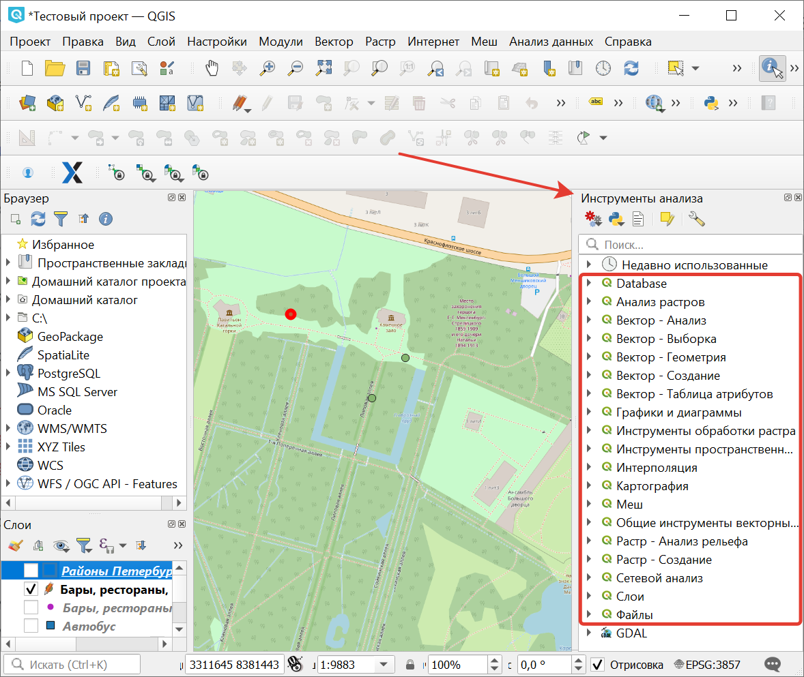

   Инструменты работы с векторными данными в панели "Инструменты анализа". 
   

Операции, запускаемые через меню Вектор, как правило, генерируют новый Shape-файл на диске. 
А если их запускать через "Инструменты анализа", то они будут генерировать временные слои. Это удобнее. 

.. note:: В "Инструментах анализа" так же доступно огромное количество операций gdal, ogr, GRASS, SAGA, и из других источников, но они могут не запускаться. Операции из раздела "QGIS" работают надёжнее. 

Инструменты анализа векторных данных
----------------------------------------------

Эти инструменты работают с векторными слоями. Как правило, они создают новый слой. 
Эти инструменты не используют преобразование координат на лету, то есть нужно, чтобы входные слои 
были в одинаковой системе координат. Если инструмент рассчитывает расстояние, то ожидается, 
что слои будут в таких системах координат, где расстояния измеряются в метрах, например UTM.  
См. так же раздел :ref:`ngq_projections`.

Анализ ближайших соседей
^^^^^^^^^^^^^^^^^^^^^^^^^^^^^^^^^^^^^^^^^^

На входе: точечный векторный слой.

Алгоритм выполняет анализ ближайших соседей для точечного слоя.
Вывод описывает, как распределяются ваши данные (кластеризуются, случайным образом или распределяются).
В результате генерируется HTML файл с вычисленной статистикой.

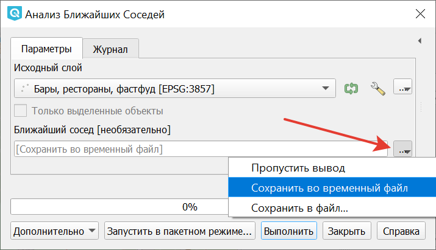

   Окно инструмента "Анализ ближайших соседей"

По умолчанию результаты сохраняются во временный файл, но можно задать его название и расположение нажав на три точки рядом с полем (см. :numref:`vectortools_nearest_pic`) и выбрав в выпадающем меню "Сохранить в файл".

Пример результатов анализа: 

Наблюдаемое среднее расстояние: 114.68516080952

Ожидаемое среднее расстояние: 1048.62303056732

Индекс ближайшего соседа: 0.10936738701

Число точек: 3117

Z-Счет: -95.12570270908

Матрица расстояний
^^^^^^^^^^^^^^^^^^^^^

Операция запускается из панели Инструменты анализа или через меню Вектор - пункт меню Анализ - Матрица расстояний:

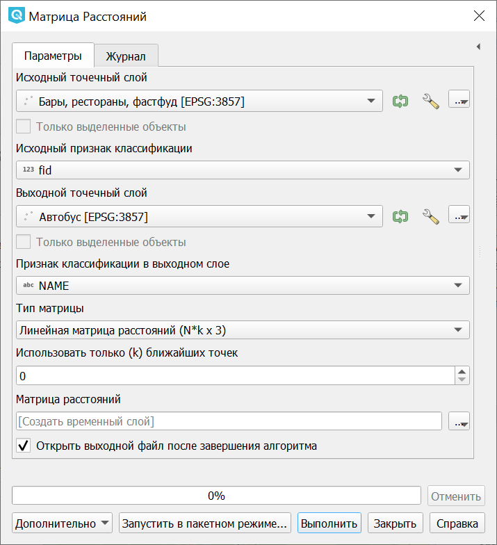
 
   Инструмент для работы с векторными данными - Матрица расстояний

На входе: два точечных слоя.

Измеряет расстояние между точками двух точечных слоёв и выдает результат в виде:

1. Квадратной матрицы расстояний. 
2. Линейной матрицы расстояний. 
3. Суммы расстояний. 

Можно ограничить расчет только для k ближайших точек. Создаёт таблицу в формате CSV.

Сумма длинн
^^^^^^^^^^^^^^^^^^^^^

Операция запускается из панели Инструменты анализа или через меню Вектор ‣ Анализ ‣ Сумма длинн:

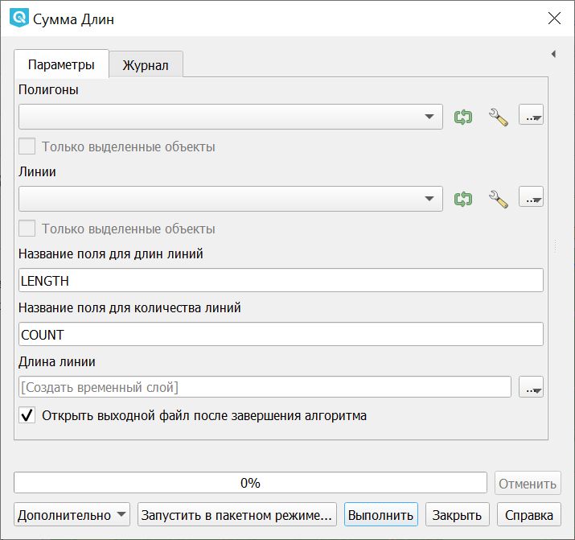

   Инструмент для работы с векторными данными - Сумма длинн

На входе: слой полигонов + пересекающий его слой линий.

Алгоритм измеряет общую длину и общее количество линий, пересекающих каждый полигон для исходных полигонального и линейного слоев.

Результирующий слой копирует объекты исходного полигонального слоя с двумя дополнительными атрибутами, содержащими длину и количество пересекающих линий. Имена этих двух полей можно настроить в параметрах алгоритма. 

Например, есть полигональный слой территорий городов и линейный слой рек. Для каждого 
города будет рассчитана суммарная длинна рек на его территории. 

Подсчет точек в полигоне
^^^^^^^^^^^^^^^^^^^^^^^^^^^^^^^^^^^^^^^^^^

Операция запускается из панели Инструменты анализа или через меню Вектор ‣ Анализ ‣ Подсчет точек в полигоне:

.. figure:: _static/ngqgis_number_of_points_in_polygons_ru.png
   :align: center
   :width: 14cm
 
   Инструмент для работы с векторными данными - Подсчет точек в полигоне
   
На входе: полигональный слой + точечный слой.

Рассчитывает число точек точечного слоя, которые находятся в пределах каждого полигона 
другого (векторного полигонального) слоя.

Результирующий слой копирует объекты исходного полигонального слоя с дополнительными полем, содержащим количество точек на каждом полигоне.

Имеется возможность выбрать статистический метод объединения атрибутов, если в точечном 
слое есть числовые атрибуты. 

Дополнительно можно указать поле веса каждой точки. В этом случае дополнительное результирующее поле будет содержать сумму весов точек, приходящихся на полигон.

Альтернативно можно указать поле классификации. Если задано, точки классифицируются по этому полю, и если в пределах полигона находится несколько точек с одинаковым значением поля, учитывается только одна из них. Таким образом, итоговый счетчик содержит количество различных классов, которые находятся в полигоне.

Одновременно нельзя использовать поле веса и поле класса, но если все таки заданы оба параметра, то будет использовано поле веса, а поле класса проигнорировано.

Пример: есть полигональный слой территорий городов и точечный слой железнодорожных 
станций. Для каждого города будет рассчитано количество находящихся в нём железнодорожных 
станций. 

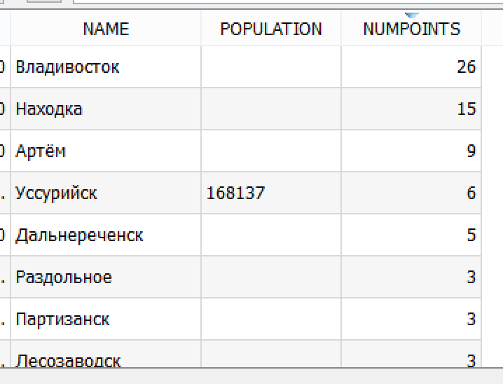
 
   Пример результата подсчета точек в полигоне

Пример: есть полигональный слой районов города и точечный слой заведений общественного 
питания с количеством посадочных мест. Для каждого района будет добавленно два атрибута: 
количество находящихся в нём заведений общественного питания и сумма всех посадочных 
мест в районе или среднее число посадочных мест в этом районе. 

Список уникальных значений
^^^^^^^^^^^^^^^^^^^^^^^^^^^^^^^^^^^^^^^^^^

Операция запускается из панели Инструменты анализа или через меню Вектор ‣ Анализ ‣ Список уникальных значений:

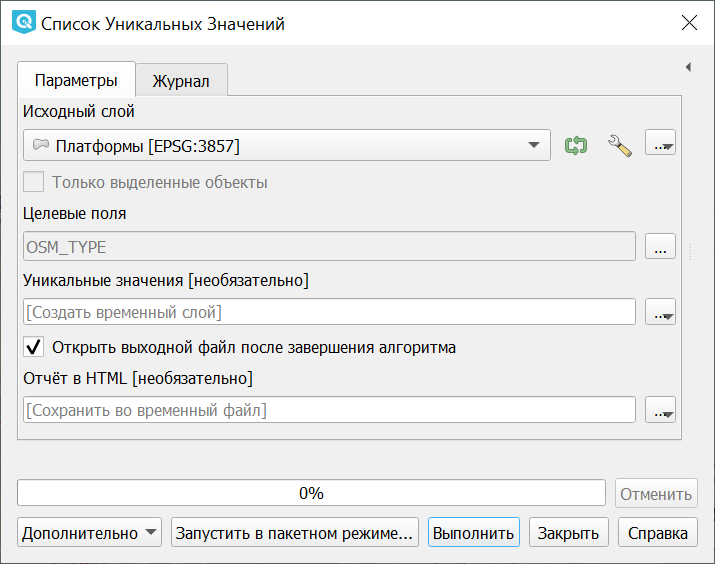
 
   Инструмент для работы с векторными данными - Список уникальных значений

Задаётся векторный слой и поле в нём. 

На выходе генерирует HTML-файл со списком всех уникальных значений для указанного поля атрибутивной 
таблицы исходного векторного слоя. 

Пример:

Всего уникальных значений:2

Уникальные значения:

way
relation

Базовая статистика
^^^^^^^^^^^^^^^^^^^^^^^^^^^^^^^^^^^^^^^^^^

Операция запускается из панели Инструменты анализа или через меню Вектор ‣ Анализ ‣ Базовая статистика для полей:

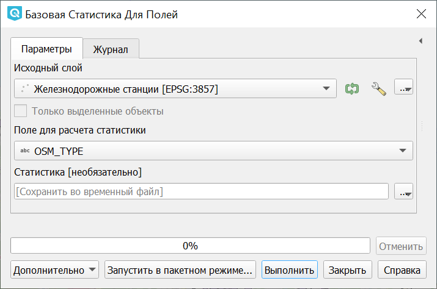
 
   Инструмент для работы с векторными данными - Базовая статистика

Задаётся векторный слой и поле в нём. Можно указать режим "Только выделенные объекты".

Алгоритм генерирует базовую статистику значений поля в таблице атрибутов векторного слоя. Поддерживаются типы полей: числовые, дата, время и строковые. Рассчитывает основные статистики (среднее, стандартное отклонение, количество, сумму, коэффициент вариации) для указанного поля. Возвращаемая статистика зависит от типа поля.

Формат вывода - файл HTML.

Средние координаты
^^^^^^^^^^^^^^^^^^^^^^^^^^^^^^^^^^^^^^^^^^

Операция запускается из панели Инструменты анализа или через меню Вектор ‣ Анализ ‣ Средние координаты:

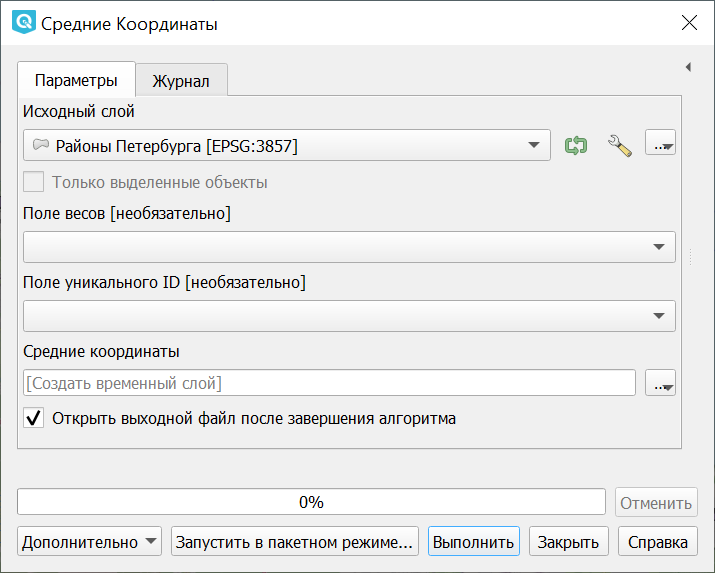

   Инструмент для работы с векторными данными - Средние координаты

Задаётся векторный слой любого типа.
Поле взвешивания (числовое), необязательно.
Поле признака классификации (любого типа), необязательно.

Рассчитывает среднеарифметические или средневзвешенные координаты центра для целого 
векторного слоя или для набора объектов, выбранного на основе уникальные значения 
из указанного поля.

Создаёт новый точечный слой.

Создать точки (центры пикселей) вдоль линий
^^^^^^^^^^^^^^^^^^^^^^^^^^^^^^^^^^^^^^^^^^^^^^^^

Операция запускается через панель Инструменты анализа:

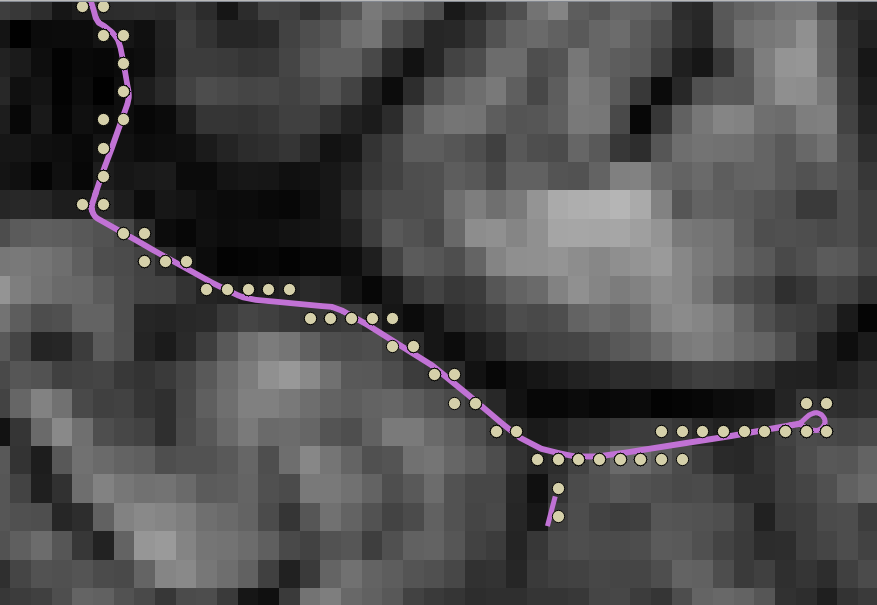

   Инструмент для работы с векторными данными - Создать точки вдоль линий.

Задаётся растровый слой и линейный слой.

Генерирует точки находящиеся в центрах пикселей, по которым проходит эта линия.

Создаёт новый точечный слой.

Пересечения линий
^^^^^^^^^^^^^^^^^^^^^^^^^^^^^^^^^^^^^^^^^^

Операция запускается через меню Вектор ‣ Анализ ‣ Пересечение линий:

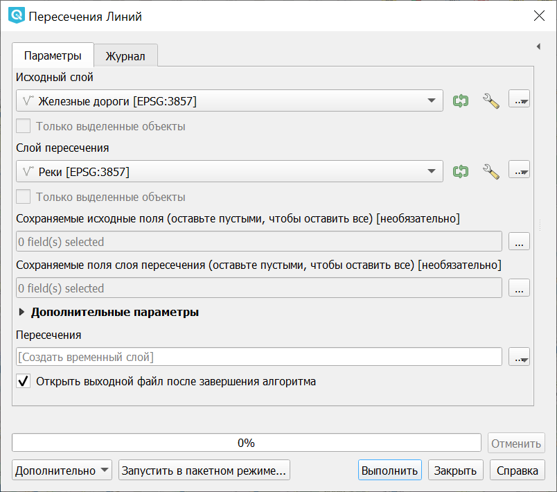

   Инструмент для работы с векторными данными - Пересечение линий.

На входе: два линейных векторных файла.

Алгоритм создает точечные объекты в местах пересечения линий исходного слоя и слоя пересечения. Полезен для определения мест пересечений дорог или водотоков. Игнорирует пересечения линий с длиной > 0. 

Создаёт новый точечный слой в формате ESRI Shapefile.

Выборка
-------

Операция запускается через пункт меню Вектор - пункт меню Выборка.

Эти инструменты выделяют объекты в заданном слое по разным алгоритмам или создают 
новый Shapefile со сгенерированными объектами.

Случайная выборка
^^^^^^^^^^^^^^^^^^^^^^^^^^^^

Операция запускается через пункт меню Вектор - пункт меню Выборка - Случайная выборка:

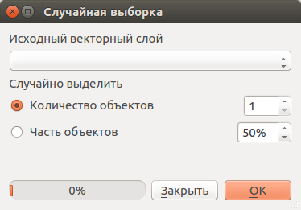

   Инструмент для работы с векторными данными - Случайная выборка.

Задаётся исходный векторный слой (любого типа).

Случайно выбирает заданное число объектов слоя или заданный процент объектов слоя.

Случайная выборка в подмножествах
^^^^^^^^^^^^^^^^^^^^^^^^^^^^^^^^^^^^^^^

Операция запускается через пункт меню Вектор - пункт меню Выборка - Случайная выборка в подмножествах:

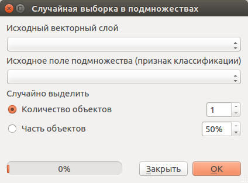
   
   Инструмент для работы с векторными данными - Случайная выборка в подмножествах.
    
Случайно выбирает набор объектов с уникальными значением указанного поля так, чтобы 
с каждым значением выбралось одинаковое число объектов.

Случайные точки
^^^^^^^^^^^^^^^^^^^^^^^^^^^^^^^^^^^^^^^

Операция запускается через пункт меню Вектор - пункт меню Выборка - Случайные точки:

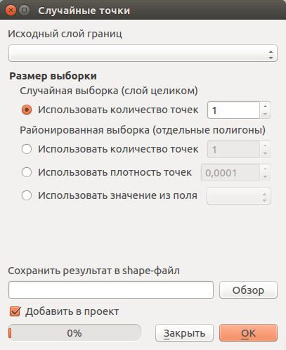

   Инструмент для работы с векторными данными - Случайные точки.

Задаётся исходный векторный слой (полигональный).

Cоздает псевдослучайные точки в пределах границ указанного слоя.

Можно задавать количество генерируемых точек, можно генерировать точки только внутри 
объектов полигонального слоя.

Создаёт новый точечный слой.

Слой генерируется в системе координат карты, будьте внимательны с преобразованием 
координат на лету.

Регулярные точки
^^^^^^^^^^^^^^^^^^^^^^^^^^^^^^^^^^^^^^^

Операция запускается через пункт меню Вектор - пункт меню Выборка - Регулярные точки:

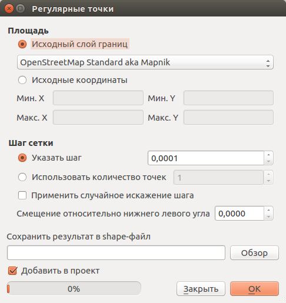
 
   Инструмент для работы с векторными данными - Регулярные точки.

Создаёт регулярную сетку точек в пределах указаной области и экспортирует их в 
точечный шейп-файл. Создаёт новый точечный слой.
Слой генерируется в системе координат карты, будьте внимательны с преобразованием 
координат на лету. Если вам нужно генерировать объекты с шагом заданных в метрах, 
используйте соответствующие системы координат.
См. так же http://docs.nextgis.ru/docs_howto/source/grid_vertex_extract.html

Векторная сетка
^^^^^^^^^^^^^^^^^^^^^^^^^^^^^^^^^^^^^^^

Операция запускается через пункт меню Вектор - пункт меню Выборка - Векторная сетка:

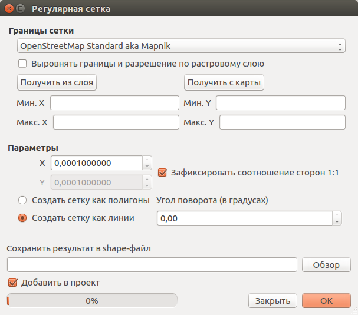

   Инструмент для работы с векторными данными - Векторная сетка.

Создаёт регулярную сетку из линий или полигонов в пределах указанной области.
Создаёт новый слой.
Слой генерируется в системе координат карты, будьте внимательны с преобразованием 
координат на лету. Если вам нужно генерировать объекты с шагом заданных в метрах, 
используйте соответствующие системы координат. 
См. так же http://docs.nextgis.ru/docs_howto/source/grid_vertex_extract.html

Пространственная выборка
^^^^^^^^^^^^^^^^^^^^^^^^^^^^^^^^^^^^^^^

Операция запускается через пункт меню Вектор - пункт меню Выборка - Пространственная выборка:

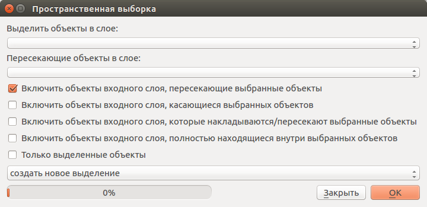

   Инструмент для работы с векторными данными - Пространственная выборка.

Выделяет объекты в одном слое, которые пересекают объекты в другом слое.
Можно выбирать, выделять ли объекты, которые касаются, пересекаются, полностью накладываются, 
находятся полностью внутри.
Можно выбирать: создавать новое выделение, добавлять к существующему выделению, 
убрать из текущего выделения.

Выделение по районам
^^^^^^^^^^^^^^^^^^^^^^^^^^^^^^^^^^^^^^^

Выделяет объекты на основе их положения относительно другого слоя, создавая новую 
выборку или добавляя/отнимая к/от текущей выборки.

Полигон из границ слоя
^^^^^^^^^^^^^^^^^^^^^^^^^^^^^^^^^^^^^^^

Операция запускается через пункт меню Вектор - пункт меню Выборка - Полигон из границ слоя:

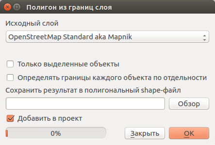

   Инструмент для работы с векторными данными - Полигон из границ слоя.

Создаёт полигональный слой с прямоугольным полигоном в соответствии с границами 
исходного растрового или векторного слоя. Так же может создавать отдельный полигон 
для каждого отдельного объекта. Создаёт новый слой.

Геообработка
------------

Операция запускается через пункт меню Вектор - пункт меню Геообработка.

Выпуклые оболочки
^^^^^^^^^^^^^^^^^^^

Операция запускается через пункт меню Вектор - пункт меню Геообработка - Выпуклые оболочки:

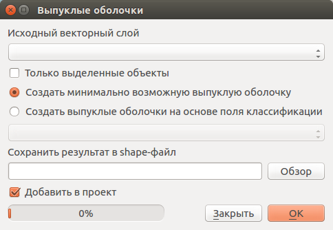

   Инструмент для работы с векторными данными - Выпуклые оболочки.

Создает минимально возможные выпуклые оболочки или выпуклые оболочки на основе указанного 
поля. Создаёт новый слой.

.. figure:: _static/vectortools_convex_hull_layer1.png
   :align: center
   :height: 10cm
   
   Исходный слой. 
   
.. figure:: _static/vectortools_convex_hull.png
   :align: center
   :height: 10cm

   Выпуклая оболочка, сгенерированная для полигонального слоя.  
   
Буферные зоны
^^^^^^^^^^^^^^^^^^^^^^^^^^^^^^^^^^^^^^^

Операция запускается через пункт меню Вектор - пункт меню Геообработка - Буферные зоны:

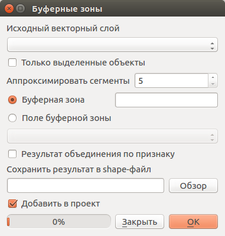

   Инструмент для работы с векторными данными - Буферные зоны.

Создает буферные зоны вокруг объектов заданного пользователем размера или используется 
размер из значений указанного поля.
Для задания буферных зон в метрах требуется, чтобы слой был в системе координат, 
которая считается в метрах. Создаёт новый слой.

Если создать очень маленький буфер для полигонального слоя, то можно таким образом 
убрать в нём ошибки геометрии. 

.. figure:: _static/vectortools_buffers_source1.png
   :align: center
   :height: 16cm

   Исходный точечный слой, для которого строятся буферные зоны.

.. figure:: _static/vectortools_buffers_result1.png
   :align: center
   :height: 16cm

   Буферные зоны.

   
.. figure:: _static/vectortools_buffers_result2.png
   :align: center
   :height: 16cm
   
   Буферные зоны - объединение по признаку - объединение по признаку.
   
Пересечение
^^^^^^^^^^^^^^^^^^^^^^^^^^^^^^^^^^^^^^^

Операция запускается через пункт меню Вектор - пункт меню Геообработка - Пересечение:

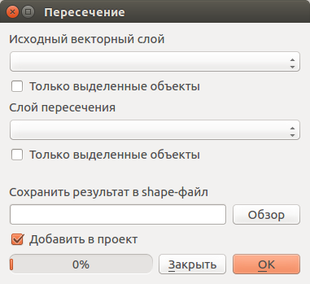

   Инструмент для работы с векторными данными - Пересечение.

Совмещает слои таким образом, что в выходном слое содержатся только участки, в которых 
оба слоя пересекаются. Создаёт новый слой.

.. figure:: _static/vectortools_intersect.png
   :align: center
   :height: 7cm

   Результат пересечения Рыбинского водохранилища и Ярославской области - территория 
   Рыбинского водохранилища, попадающего в Ярославскую область. 

   .. http://trolleway.nextgis.com/api/component/render/image?resource=553,554,471&extent=3997962.3274278585,7692622.5266201375,5069303.715872889,8220955.266127276&size=877,433

Инструмент "Пересечение" в результирующем слое создаёт атрибуты из обоих исходных слоёв. 

Объединение
^^^^^^^^^^^^^^^^^^^^^^^^^^^^^^^^^^^^^^^

Операция запускается через пункт меню Вектор - пункт меню Геообработка - Объединение:

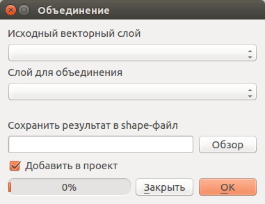

   Инструмент для работы с векторными данными - Объединение.

Совмещает слои таким образом, что в выходном слое содержатся как участки пересечения, 
так и участки, принадлежащие только одному из слоев. Создаёт новый Shapefile.

.. figure:: _static/vectortools_union.png
   :align: center
   :height: 7cm

   Результат объединения Рыбинского водохранилища и Ярославской области - территория 
   и области, и всего водохранилища. 
   
.. http://trolleway.nextgis.com/api/component/render/image?resource=553,554,473&extent=3997962.3274278585,7692622.5266201375,5069303.715872889,8220955.266127276&size=877,433

Отсечение
^^^^^^^^^^^^^^^^^^^^^^^^^^^^^^^^^^^^^^^

Операция запускается через пункт меню Вектор - пункт меню Геообработка - Обрезка - Отсечение:

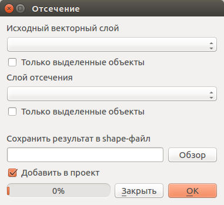

   Инструмент для работы с векторными данными - Отсечение.

Совмещает слои таким образом, что в выходном слое содержатся только те участки, 
которые пересекаются со слоем отсечения.

Обрезка
^^^^^^^^^^^^^^^^^^^^^^^^^^^^^^^^^^^^^^^

Совмещает слои таким образом, что в выходном слое содержатся только те участки, 
которые не пересекаются со слоем отсечения. Создаёт новый слой.

.. figure:: _static/vectortools_clip.png
   :align: center
   :height: 7cm

   Результат обрезки. 
 
.. http://trolleway.nextgis.com/api/component/render/image?resource=553,554,467&extent=3997962.3274278585,7692622.5266201375,5069303.715872889,8220955.266127276&size=877,433

Инструмент Clip в результирующем слое создаёт атрибуты только из второго исходного слоя. 

Разность
^^^^^^^^^^^^^^^^^^^^^^^^^^^^^^^^^^^^^^^

Операция запускается через пункт меню Вектор - пункт меню Геообработка - Разность:

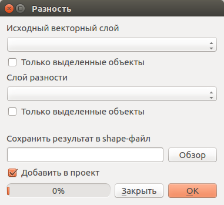

   Инструмент для работы с векторными данными - Разность.

Совмещает слои таким образом, что в выходном слое содержатся только те участки, 
которые не пересекаются со слоем отсечения. Создаёт новый слой.

.. figure:: _static/vectortools_difference.png
   :align: center
   :height: 7cm
   
   Результат разности.
   
.. http://trolleway.nextgis.com/api/component/render/image?resource=553,554,475&extent=3997962.3274278585,7692622.5266201375,5069303.715872889,8220955.266127276&size=877,433

Симметричная разность
^^^^^^^^^^^^^^^^^^^^^^^^^^^^^^^^^^^^^^^

Операция запускается через пункт меню Вектор - пункт меню Геообработка - Симметричная разность:

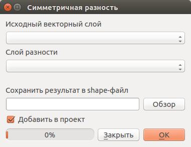

   Инструмент для работы с векторными данными - Симметричная разность.

Совмещает слои таким образом, что в выходном слое содержатся только те участки, 
в которых исходные слои не пересекаются. Создаёт новый слой.

.. figure:: _static/vectortools_symmetrical_difference.png
   :align: center
   :height: 7cm
   
   Результат симметричной разности.
   
.. http://trolleway.nextgis.com/api/component/render/image?resource=553,554,477&extent=3997962.3274278585,7692622.5266201375,5069303.715872889,8220955.266127276&size=877,433

Объединение по признаку
^^^^^^^^^^^^^^^^^^^^^^^^^^^^^^^^^^^^^^^

Операция запускается через пункт меню Вектор - пункт меню Геообработка - Объединение по признаку:

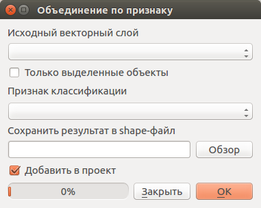

   Инструмент для работы с векторными данными - Объединение по признаку.

Объединяет объекты на основе значения указанного поля. Все объекты с одинаковым 
значением поля будут объединены в один объект. Создаёт новый слой.

Удаление осколочных полигонов
^^^^^^^^^^^^^^^^^^^^^^^^^^^^^^^^^^^^^^^

Операция запускается через пункт меню Вектор - пункт меню Геообработка - Удаление осколочных полигонов:

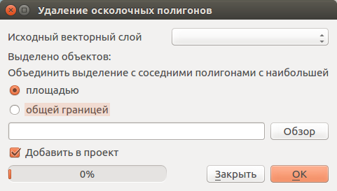

   Инструмент для работы с векторными данными - Удаление осколочных полигонов.

Объединяет выделенные объекты с соседним полигоном, площадь или длина общей границы 
которого наибольшая. Создаёт новый слой.

Обработка геометрии
-------------------------------------

Операция запускается через пункт меню Вектор - пункт меню Обработка геометрии.	

Проверка геометрии
^^^^^^^^^^^^^^^^^^^^^^^^^^^^^^^^^^^^^^^

Операция запускается через пункт меню Вектор - пункт меню Обработка геометрии - Проверка геометрии:

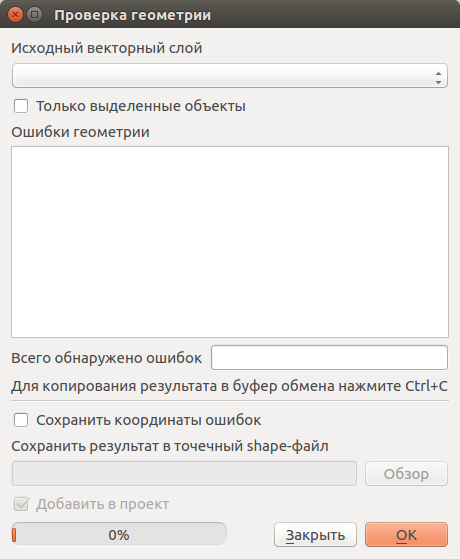

   Инструмент для работы с векторными данными - Проверка геометрии.

Проверяет полигоны на наличие пересечений, «островов» и неправильного порядка нумерации 
узлов.

Экспортировать / добавить поле геометрии
^^^^^^^^^^^^^^^^^^^^^^^^^^^^^^^^^^^^^^^^^^^^^^

Операция запускается через пункт меню Вектор - пункт меню Обработка геометрии - 
Экспортировать/добавить поле геометрии:

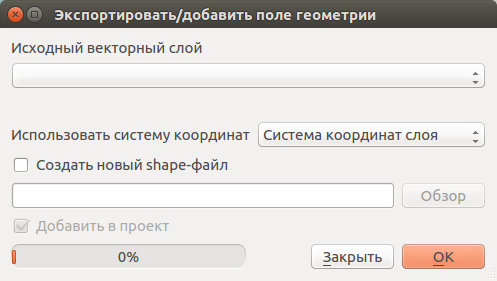

   Инструмент для работы с векторными данными - Экспортировать/добавить поле геометрии.

Добавляет к слою поле(я) с информацией о геометрии: (XCOORD, YCOORD) для точечного 
слоя, (LENGTH) для линейного и (AREA, PERIMETER) для полигонального.
Длины и площади будут рассчитаны в единицах координат слоя.

Центроиды полигонов
^^^^^^^^^^^^^^^^^^^^^^^^^^^^^^^^^^^^^^^

Операция запускается через пункт меню Вектор - пункт меню Обработка геометрии - Центроиды полигонов:

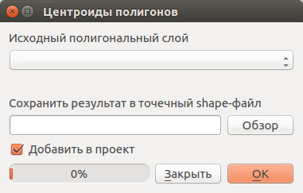

   Инструмент для работы с векторными данными - Центроиды полигонов.

Вычисляет истинные центроиды для каждого полигона исходного полигонального слоя.

.. figure:: _static/vectortools_centroids.png
   :align: center
   :height: 7cm
   
   Результат генерации центроидов для 4 полигонов. 
   
.. http://trolleway.nextgis.com/api/component/render/image?resource=1032,1034&extent=3997962.3274278585,7692622.5266201375,5069303.715872889,8220955.266127276&size=877,433

Триангуляция Делоне
^^^^^^^^^^^^^^^^^^^^^^^^^^^^^^^^^^^^^^^

Операция запускается через пункт меню Вектор - пункт меню Обработка геометрии - Триангуляция Делоне:

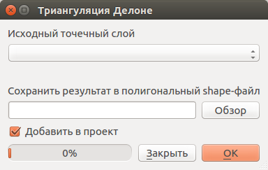

   Инструмент для работы с векторными данными - Триангуляция Делоне.

Рассчитывает и строит (как полигональный слой) триангуляцию Делоне для исходного 
точечного слоя.
Создаёт новый слой.

Полигоны Вороного 
^^^^^^^^^^^^^^^^^^^^^^^^^^^^^^^^^^^^^^^

Операция запускается через пункт меню Вектор - пункт меню Обработка геометрии - Полигоны Вороного:

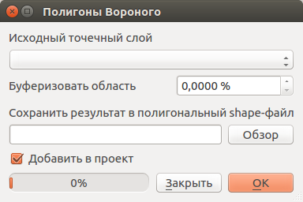

   Инструмент для работы с векторными данными - Полигоны Вороного.

Генерирует полигоны Вороного для исходного точечного слоя.
Создаёт новый слой.

Упростить геометрию
^^^^^^^^^^^^^^^^^^^^^^^^^^^^^^^^^^^^^^^

Операция запускается через пункт меню Вектор - пункт меню Обработка геометрии - Упростить геометрию:

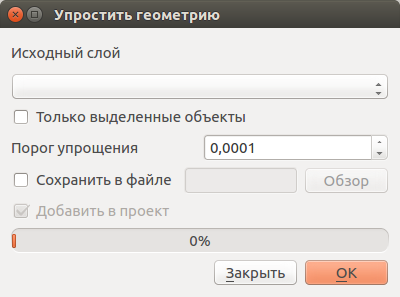

   Инструмент для работы с векторными данными - Упростить геометрию.

Упрощает линии или полигоны при помощи модифицированного алгоритма Дугласа – Пойкера.
Создаёт новый слой.

Добавить вершины
^^^^^^^^^^^^^^^^^^^^^^^^^^^^^^^^^^^^^^^

Операция запускается через пункт меню Вектор - пункт меню Обработка геометрии - Добавить вершины:

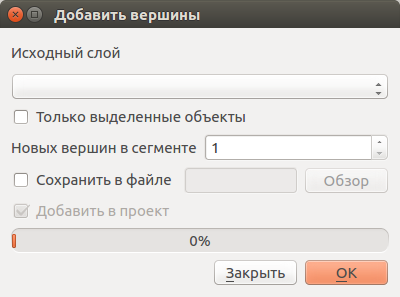

   Инструмент для работы с векторными данными - Добавить вершины.

Добавляет дополнительные вершины к объектам линейного или полиногнального слоя.

Разбить составную геометрию
^^^^^^^^^^^^^^^^^^^^^^^^^^^^^^^^^^^^^^^

Операция запускается через пункт меню Вектор - пункт меню Обработка геометрии - Разбить составную геометрию:

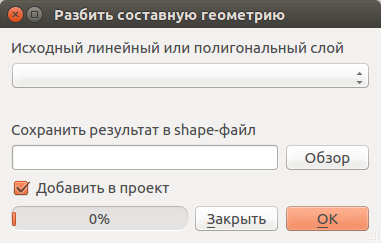

   Инструмент для работы с векторными данными - Разбить составную геометрию.

Преобразует составные объекты (мульти-полигоны или мульти-полилинии) в несколько 
простых объектов (полигонов или полилиний).

Объединить геометрию в составную
^^^^^^^^^^^^^^^^^^^^^^^^^^^^^^^^^^^^^^^

Операция запускается через пункт меню Вектор - пункт меню Обработка геометрии - Объединить геометрию в составную:

.. figure:: _static/ngqgis_integrate_geometry_into_a_composite.png
   :align: center
   :width: 12cm

   Инструмент для работы с векторными данными - Объединить геометрию в составную.

Объединяет несколько простых объектов в один составной на основе значения указанного 
поля.

Преобразовать полигоны в линии
^^^^^^^^^^^^^^^^^^^^^^^^^^^^^^^^^^^^^^^

Операция запускается через пункт меню Вектор - пункт меню Обработка геометрии - Преобразовать полигоны в линии:

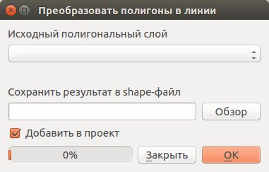

   Инструмент для работы с векторными данными - Преобразовать полигоны в линию. 

Преобразует полигоны в линии, составные полигоны преобразует в несколько простых 
полилиний.

Преобразовать линии в полигоны
^^^^^^^^^^^^^^^^^^^^^^^^^^^^^^^^^^^^^^^

Операция запускается через пункт меню Вектор - пункт меню Обработка геометрии - Преобразовать линии в полигоны:

.. figure:: _static/ngqgis_converting_line_into_polygons.png
   :align: center
   :width: 12cm

   Инструмент для работы с векторными данными - Преобразовать линии в полигоны.

Преобразует линии в полигоны, составные линии преобразует в несколько простых полигонов.

Извлечение узлов
^^^^^^^^^^^^^^^^^^^^^^^^^^^^^^^^^^^^^^^

Операция запускается через пункт меню Вектор - пункт меню Обработка геометрии - Извлечение узлов:

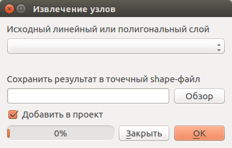

   Инструмент для работы с векторными данными - Извлечение узлов.

Извлекает узлы из линий или полигонов, создавая точечный слой.

Общие инструменты для работы с векторами
---------------------------------------------

Операция запускается через пункт меню Вектор - пункт меню Управление данными.

Задать текущую проекцию
^^^^^^^^^^^^^^^^^^^^^^^^^^^^^^^^^^^^^^^

Операция запускается через пункт меню Вектор - пункт меню Управление данными - Задать текущую проекцию:

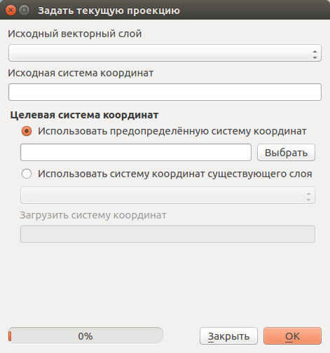

   Инструмент для работы с векторными данными - Задать текущую проекцию.

Задает проекцию для шейп-файла, если ранее она не была задана.

Объединение атрибутов по районам
^^^^^^^^^^^^^^^^^^^^^^^^^^^^^^^^^^^^^^^

Операция запускается через пункт меню Вектор - пункт меню Управление данными - Объединение атрибутов по районам:

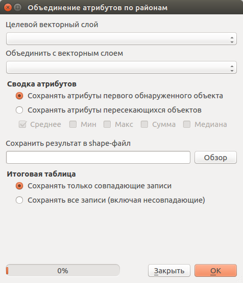

   Инструмент для работы с векторными данными - Объединение атрибутов по районам.

Присоединяет дополнительные атрибуты к векторному слою на основе пространственного 
взаимного расположения. Атрибуты из одного векторного слоя присоединяются к атрибутивной 
таблице другого векторного слоя и экспортируются в слой.

Разбить векторный слой
^^^^^^^^^^^^^^^^^^^^^^^^^^^^^^^^^^^^^^^

Операция запускается через пункт меню Вектор - пункт меню Управление данными - Разбить векторный слой:

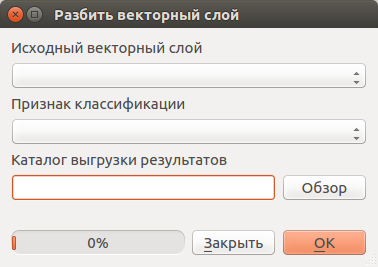

   Инструмент для работы с векторными данными - Разбить векторный слой.

Делит векторный слой на несколько отдельных слоев на основе значения указанного 
поля.

Объединить векторные слои
^^^^^^^^^^^^^^^^^^^^^^^^^^^^^^^^^^^^^^^

Операция запускается через пункт меню Вектор - пункт меню Управление данными - Объединить векторные слои:

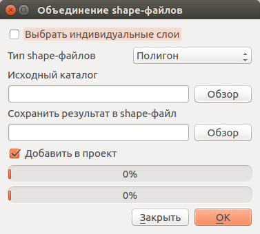

   Инструмент для работы с векторными данными - Объединить векторные слои.

Объединяет несколько векторных слоёв в один (можно выбирать больше двух).
 	
Создать пространственный индекс
^^^^^^^^^^^^^^^^^^^^^^^^^^^^^^^^^^^^^^^

Операция запускается через пункт меню Вектор - пункт меню Управление данными - Создать пространственный индекс:

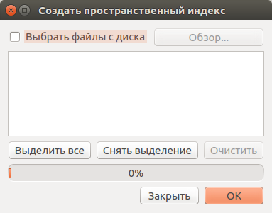

   Инструмент для работы с векторными данными - Создать пространственный индекс.

Создать пространственный индекс для форматов, поддерживаемых OGR. Он сохраняется 
посредством OGR.

Ориентированный охватывающий прямоугольник
^^^^^^^^^^^^^^^^^^^^^^^^^^^^^^^^^^^^^^^^^^^

Oriented minimum bounding box

Для каждого обьекта строит охватывающий прямоугольник, который повёрнут так, чтобы 
получалась меньшая площадь. В атрибуты записываются: 

* площадь,
* угол,
* периметр,
* длина,
* ширина.

.. figure:: _static/vectortools_Oriented_MBBox.png
   :align: center
   :width: 16cm

   Ориентированные охватывающие прямоугольники, построенные для слоя территорий городов.

Сетевой анализ - зона охвата
^^^^^^^^^^^^^^^^^^^^^^^^^^^^^^^^^^^^^^^^^^^

Service area

Будет доступно с версии 3

Задаётся линейный слой представляющий граф, и точечный слой. Инструмент создаёт линейный слой, который состоит из тех линий, что находятся в пределах заданного расстояния или времени по графу. Можно выбрать режим расчёта: по времени или по дистанции, максимальное значение задаётся в поле travel_cost. Так же можно указывать, из каких атрибутов берётся направление и скорость для участка графа.
Инструмент нормально работает, если слои в метрах (UTM). Точки не обязательно должны прилипать к дороге.

.. figure:: _static/vectortools_service_area.png
   :align: center
   :width: 16cm

   Слой сгенерированый инструментом service area.
   
Пиксели в точки, пиксели в полигоны
^^^^^^^^^^^^^^^^^^^^^^^^^^^^^^^^^^^^^^^^^

Принимает на вход растр, генерирует векторный слой с точками в центре пикселов растра. 

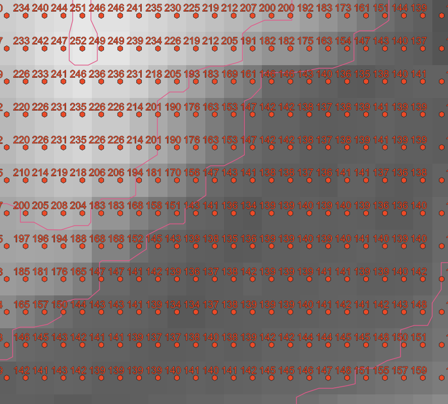

   Слой сгенерированый инструментом пикселы в точки.
   
Окно "Инструменты анализа"
^^^^^^^^^^^^^^^^^^^^^^^^^^^^^^^^^^^^^^^^^

Это более новый способ запуска операций геообработки. Раньше инструменты запускались через меню "Вектор", теперь добавилось это окно. В нём доступно больше операций.

Отличительные особенности processing:

* Результат работы модулей - временные слои. Это удобно тем, что у вас не появляются кучи файлов. 
  Так же можно сохранять результат в файлы.
* Можно обрабатывать данные, содержащиеся во временных слоях.
* Текстовый поиск названий модулей.
* В одном месте видны так же и модули из пакетов Saga, GDAL и других дополнительных плагинов.
* Модели - сохранение последовательности операций.

При идентификации, если включён режим "открывать форму", то при нажатии на несколько объектов 
по очереди выделение может не сниматься. Это не является ошибкой: где-то на дисплее остаются 
открытые окна идентификации, вот они и остаются красные. 

