.. sectionauthor:: Дмитрий Барышников <dmitry.baryshnikov@nextgis.ru>, Юлия Григоренко <grigorenko.j@gmail.com>

.. _ngq_vector_op:

Работа с векторными данными
===========================

Векторные операции можно запускать двумя способами:

* Старый способ: через меню Вектор.
* Новый способ: через модуль Processing (Инструменты анализа). 
Этим способом пользоваться удобнее. Некоторые инструменты доступны только в нём.

   Инструменты работы с векторными данными в панели "Инструменты анализа". 
   
Отличия модулей "Инструмены анализа":

* Доступно больше операций.
* Операции, запускаемые через меню Вектор, как правило, генерируют новый Shape-файл на диске. А если их запускать через "Инструменты анализа", то они будут генерировать временные слои. Это удобно тем, что у вас не появляются кучи файлов. Так же можно сохранять результат в файлы.
* Можно обрабатывать данные, содержащиеся во временных слоях.
* Текстовый поиск названий модулей.
* В одном месте видны так же и модули из пакетов Saga, GDAL и других дополнительных плагинов.
* Модели - сохранение последовательности операций.

.. _ngq_vector_op_analyse:

Инструменты анализа векторных данных
----------------------------------------------

Эти инструменты работают с векторными слоями. Как правило, они создают новый слой. 
Эти инструменты не используют преобразование координат на лету, то есть нужно, чтобы входные слои 
были в одинаковой системе координат. Если инструмент рассчитывает расстояние, то ожидается, 
что слои будут в таких системах координат, где расстояния измеряются в метрах, например UTM.  
См. так же раздел :ref:`ngq_projections`.

Часть этих инструментов может быть вызвана через меню Вектор ‣ Анализ:

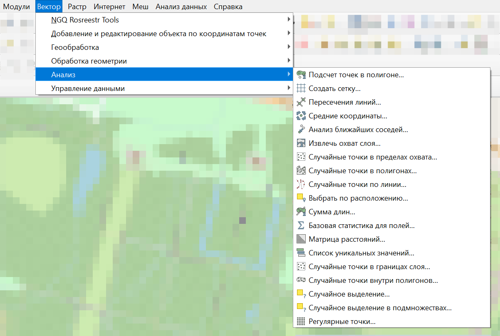
   
   Выпадающее меню Анализ

.. _ngq_vector_op_nearest:

Анализ ближайших соседей
^^^^^^^^^^^^^^^^^^^^^^^^^^^^^^^^^^^^^^^^^^

На входе: точечный векторный слой.

Алгоритм выполняет анализ ближайших соседей для точечного слоя.
Вывод описывает, как распределяются ваши данные (кластеризуются, случайным образом или распределяются).
В результате генерируется HTML файл с вычисленной статистикой.

.. figure:: _static/vectortools_nearest_ru.png
   :align: center
   :name: nearestneighbouranalisys_pic
   :width: 14cm

   Окно инструмента "Анализ ближайших соседей"

По умолчанию результаты сохраняются во временный файл, но можно задать его название и расположение нажав на три точки рядом с полем (см. :numref:`vectortools_nearest_pic`) и выбрав в выпадающем меню "Сохранить в файл".

Пример результатов анализа: 

Наблюдаемое среднее расстояние: 114.68516080952

Ожидаемое среднее расстояние: 1048.62303056732

Индекс ближайшего соседа: 0.10936738701

Число точек: 3117

Z-Счет: -95.12570270908

.. _ngq_vector_op_distmatrix:

Матрица расстояний
^^^^^^^^^^^^^^^^^^^^^

Операция запускается из панели Инструменты анализа или через меню Вектор - пункт меню Анализ - Матрица расстояний:

.. figure:: _static/ngqgis_distance_matrix_ru.png
   :align: center
   :name: distancematrix_pic
   :width: 14cm
 
   Инструмент для работы с векторными данными - Матрица расстояний

На входе: два точечных слоя.

Измеряет расстояние между точками двух точечных слоёв и выдает результат в виде:

1. Квадратной матрицы расстояний. 
2. Линейной матрицы расстояний. 
3. Суммы расстояний. 

Можно ограничить расчет только для k ближайших точек. Создаёт таблицу в формате CSV.

.. _ngq_vector_op_sumlengths:

Сумма длин
^^^^^^^^^^^^^^^^^^^^^

Операция запускается из панели Инструменты анализа или через меню Вектор ‣ Анализ ‣ Сумма длин:

   Инструмент для работы с векторными данными - Сумма длин

На входе: слой полигонов + пересекающий его слой линий.

Алгоритм измеряет общую длину и общее количество линий, пересекающих каждый полигон для исходных полигонального и линейного слоев.

Результирующий слой копирует объекты исходного полигонального слоя с двумя дополнительными атрибутами, содержащими длину и количество пересекающих линий. Имена этих двух полей можно настроить в параметрах алгоритма. 

Например, есть полигональный слой территорий городов и линейный слой рек. Для каждого 
города будет рассчитана суммарная длина рек на его территории. 

.. _ngq_vector_op_countpointsinpoly:

Подсчет точек в полигоне
^^^^^^^^^^^^^^^^^^^^^^^^^^^^^^^^^^^^^^^^^^

Операция запускается из панели Инструменты анализа или через меню Вектор ‣ Анализ ‣ Подсчет точек в полигоне:

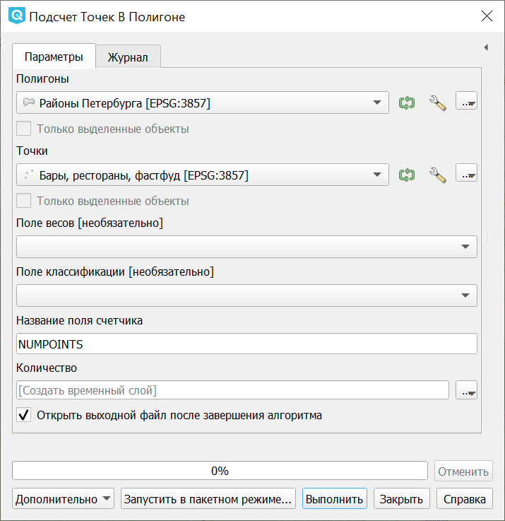
 
   Инструмент для работы с векторными данными - Подсчет точек в полигоне
   
На входе: полигональный слой + точечный слой.

Рассчитывает число точек точечного слоя, которые находятся в пределах каждого полигона 
другого (векторного полигонального) слоя.

Результирующий слой копирует объекты исходного полигонального слоя с дополнительными полем, содержащим количество точек на каждом полигоне.

Имеется возможность выбрать статистический метод объединения атрибутов, если в точечном 
слое есть числовые атрибуты. 

Дополнительно можно указать поле веса каждой точки. В этом случае дополнительное результирующее поле будет содержать сумму весов точек, приходящихся на полигон.

Альтернативно можно указать поле классификации. Если задано, точки классифицируются по этому полю, и если в пределах полигона находится несколько точек с одинаковым значением поля, учитывается только одна из них. Таким образом, итоговый счетчик содержит количество различных классов, которые находятся в полигоне.

Одновременно нельзя использовать поле веса и поле класса, но если все таки заданы оба параметра, то будет использовано поле веса, а поле класса проигнорировано.

Пример: есть полигональный слой территорий городов и точечный слой железнодорожных 
станций. Для каждого города будет рассчитано количество находящихся в нём железнодорожных 
станций. 

.. figure:: _static/ngqgis_number_of_points_in_polygons_table.png
   :align: center
   :width: 12cm
 
   Пример результата подсчета точек в полигоне

Пример: есть полигональный слой районов города и точечный слой заведений общественного 
питания с количеством посадочных мест. Для каждого района будет добавленно два атрибута: 
количество находящихся в нём заведений общественного питания и сумма всех посадочных 
мест в районе или среднее число посадочных мест в этом районе. 

.. _ngq_vector_op_listuniquevalues:

Список уникальных значений
^^^^^^^^^^^^^^^^^^^^^^^^^^^^^^^^^^^^^^^^^^

Операция запускается из панели Инструменты анализа или через меню Вектор ‣ Анализ ‣ Список уникальных значений:

 
   Инструмент для работы с векторными данными - Список уникальных значений

Задаётся векторный слой и поле в нём. 

На выходе генерирует HTML-файл со списком всех уникальных значений для указанного поля атрибутивной 
таблицы исходного векторного слоя. 

Пример:

Всего уникальных значений:2

Уникальные значения:

way
relation

.. _ngq_vector_op_basicstat:

Базовая статистика
^^^^^^^^^^^^^^^^^^^^^^^^^^^^^^^^^^^^^^^^^^

Операция запускается из панели Инструменты анализа или через меню Вектор ‣ Анализ ‣ Базовая статистика для полей:

 
   Инструмент для работы с векторными данными - Базовая статистика

Задаётся векторный слой и поле в нём. Можно указать режим "Только выделенные объекты".

Алгоритм генерирует базовую статистику значений поля в таблице атрибутов векторного слоя. Поддерживаются типы полей: числовые, дата, время и строковые. Рассчитывает основные статистики (среднее, стандартное отклонение, количество, сумму, коэффициент вариации) для указанного поля. Возвращаемая статистика зависит от типа поля.

Формат вывода - файл HTML.

.. _ngq_vector_op_create:

Инструменты создания векторных объектов
-------------------------------------

.. _ngq_vector_op_meancoordinates:

Средние координаты
^^^^^^^^^^^^^^^^^^^^^^^^^^^^^^^^^^^^^^^^^^

Операция запускается из панели Инструменты анализа или через меню Вектор ‣ Анализ ‣ Средние координаты:

.. figure:: _static/ngqgis_average_coordinates_ru.png
   :align: center
   :name: meancoordinates_pic
   :width: 14cm

   Инструмент для работы с векторными данными - Средние координаты

Задаётся векторный слой любого типа.
Поле взвешивания (числовое), необязательно.
Поле признака классификации (любого типа), необязательно.

Рассчитывает среднеарифметические или средневзвешенные координаты центра для целого 
векторного слоя или для набора объектов, выбранного на основе уникальные значения 
из указанного поля.

Создаёт новый точечный слой.

.. _ngq_vector_op_pointsalongline:

Создать точки (центры пикселей) вдоль линий
^^^^^^^^^^^^^^^^^^^^^^^^^^^^^^^^^^^^^^^^^^^^^^^^

Операция запускается через панель Инструменты анализа в разделе "Вектор - создание":

   Инструмент для работы с векторными данными - Создать точки вдоль линий

Задаётся растровый слой и линейный слой.

Генерирует точки находящиеся в центрах пикселей, по которым проходит эта линия.

Создаёт новый точечный слой.

.. figure:: _static/ngqgis_points_along_line.png
   :align: center
   :width: 12cm
   
   Результат работы инструмента создания точек

.. _ngq_vector_op_lineintersections:

Пересечения линий
^^^^^^^^^^^^^^^^^^^^^^^^^^^^^^^^^^^^^^^^^^

Операция запускается из панели Инструменты анализа или через меню Вектор ‣ Анализ ‣ Пересечение линий:

   Инструмент для работы с векторными данными - Пересечение линий.

На входе: два линейных векторных файла.

Алгоритм создает точечные объекты в местах пересечения линий исходного слоя и слоя пересечения. Полезен для определения мест пересечений дорог или водотоков. Игнорирует пересечения линий с длиной > 0. 

Создаёт новый точечный слой в формате ESRI Shapefile.

.. _ngq_vector_op_randompointsinlayer:

Случайные точки в границах слоя
^^^^^^^^^^^^^^^^^^^^^^^^^^^^^^^^^^^^^^^

Операция запускается через через панель Инструменты анализа в разделе "Вектор - Создание" или в меню Вектор ‣ Анализ ‣ Случайные точки в границах слоя.

   Случайные точки в границах слоя

Задаётся исходный векторный слой (полигональный).

Cоздает псевдослучайные точки в пределах границ указанного слоя.

Можно задавать количество генерируемых точек, можно генерировать точки только внутри 
объектов полигонального слоя.

Создаёт новый точечный слой.

Слой генерируется в системе координат карты, будьте внимательны с преобразованием 
координат на лету.

.. _ngq_vector_op_randompointsinpoly:

Случайные точки в полигонах
^^^^^^^^^^^^^^^^^^^^^^^^

Операция запускается через через панель Инструменты анализа в разделе "Вектор - Создание" или в меню Вектор ‣ Анализ ‣ Случайные точки в полигонах.

Алгоритм создает точечный слой, в котором точки случайным образом помещаются в полигоны входного полигонального слоя.

   
   Случайные точки в полигонах

Можно задать следующие параметры:

**Минимальное расстояние между точками** и **глобальное минимальное расстояние** между точками.

.. note:: Точка не будет добавлена, если уже есть сгенерированная точка на этом (евклидовом) расстоянии от сгенерированного местоположения. Если задано минимальное расстояние между точками, то учитываются только точки в одном и том же полигональном объекте, в то время как если заданно глобальное минимальное расстояние между точками учитываются все ранее созданные точки. Если глобальное минимальное расстояние установлено равным или превышающим (локальное) минимальное расстояние, то последнее не действует.
Если минимальное расстояние слишком велико, то может оказаться невозможным создать указанное количество точек для каждого объекта, но все сгенерированные точки возвращаются.

**Максимальное количество попыток** на точку.

**Порождающее значение** для генератора случайных чисел (random seed - целое число, больше 0).

Можно **отключить наследование атрибутов** полигональных объектов результирующими точечными объектами (снять флажок пункта "Включить атрибуты полигона").

Общее количество точек будет равно количеству входных объектов помноженному на количество точек для каждого объекта, если не было пропущенных точек. Количество точек для каждого объекта, минимальное расстояние между точками и максимальное количество попыток на точку могут быть определены данными. 

Выходные данные алгоритма: 

* Количество объектов с пустой геометрией или без нее (FEATURES_WITH_EMPTY_OR_NO_GEOMETRY).
* Точечный слой, содержащий случайные точки (OUTPUT).
* Количество сгенерированных объектов (OUTPUT_POINTS). 
* Число пропущенных точек (POINTS_MISSED). 
* Количество объектов с непустой геометрией и пропущенными точками (POLYGONS_WITH_MISSED_POINTS).

.. _ngq_vector_op_regularpoints:

Регулярные точки
^^^^^^^^^^^^^^^^^^^^^^^^^^^^^^^^^^^^^^^

Операция запускается через через панель Инструменты анализа в разделе "Вектор - Создание" или в меню Вектор ‣ Анализ ‣ Регулярные точки.

 
   Инструмент для работы с векторными данными - Регулярные точки

Создаёт регулярную сетку точек в пределах указаной области и экспортирует их в 
точечный шейп-файл. Создаёт новый точечный слой.
Слой генерируется в системе координат карты, будьте внимательны с преобразованием 
координат на лету. Если вам нужно генерировать объекты с шагом, заданным в метрах, 
используйте соответствующие системы координат.
См. так же http://docs.nextgis.ru/docs_howto/source/grid_vertex_extract.html

.. _ngq_vector_op_creategrid:

Векторная сетка
^^^^^^^^^^^^^^^^^^^^^^^^^^^^^^^^^^^^^^^

Операция запускается через через панель Инструменты анализа в разделе "Вектор - Создание" или в меню Вектор ‣ Анализ ‣ Создать сетку:

   Инструмент для работы с векторными данными - Создать сетку
   
Создаёт регулярную сетку из линий или полигонов в пределах указанной области **охвата**.

Сетка может быть сформирована точечными, линейными или полигональными **элементами** (прямоугольник, ромб, шестиугольник). Размер и/или расположение элементов сетки определяется горизонтальным и вертикальным **шагом**. 

Для слоя сетки нужно указать **систему координат**.

Значения охвата и шага сетки задаются в координатах и **единицах** этой СК. Если вам нужно генерировать объекты с шагом заданных в метрах, используйте соответствующие системы координат. 

Точкой привязки сетки является левый верхний угол (minX, maxY). Это означает, что в этой точке гарантированно будет размещен элемент сетки. Если ширина и высота охвата не кратны заданному шагу, то совсем не обязательно что в этот экстент попадут еще элементы.

Создаёт новый слой.

См. так же http://docs.nextgis.ru/docs_howto/source/grid_vertex_extract.html

.. _ngq_vector_op_select:

Выборка
-------

Запускается через панель Инструменты анализа в разделе "Вектор - Выборка". Некоторые из них также доступны в меню Вектор ‣ Анализ.

Эти инструменты выделяют объекты в заданном слое по разным алгоритмам или создают 
новый Shapefile со сгенерированными объектами.

.. _ngq_vector_op_randomselection:

Случайное выделение
^^^^^^^^^^^^^^^^^^^^^^^^^^^^

Операция запускается через панель Инструменты анализа в разделе "Вектор - Выборка" или в меню Вектор ‣ Анализ ‣ Случайное выделение:

   Инструмент для работы с векторными данными - Случайное выделение

Задаётся исходный векторный слой (любого типа).

Случайно выбирает заданное число объектов слоя или заданный процент объектов слоя.

Алгоритм не создает новый слой.

.. _ngq_vector_op_randomselsubsets:

Случайное выделение в подмножествах
^^^^^^^^^^^^^^^^^^^^^^^^^^^^^^^^^^^^^^^

Операция запускается через панель Инструменты анализа в разделе "Вектор - Выборка" или в меню Вектор ‣ Анализ ‣ Случайное выделение в подмножествах:

   
   Инструмент для работы с векторными данными - Случайное выделение в подмножествах
    
Алгоритм выбирает объекты в подмножествах (категориях) векторного слоя . Алгоритм не создает новый слой.

Случайно выбирает набор объектов с уникальными значением указанного поля так, чтобы 
с каждым значением выбралось одинаковое число объектов.

Значение доля/количество применяется не ко всему слою, а к каждой категории. Категории определяются в соответствии с заданным атрибутом.

.. _ngq_vector_op_selectbylocation:

Выбрать по расположению
^^^^^^^^^^^^^^^^^^^^^^^^^^^^^^^^^^^^^^^

Операция запускается через панель Инструменты анализа в разделе "Вектор - Выборка":

   Инструмент для работы с векторными данными - Выбрать по расположению
   
Выделяет объекты в одном слое, которые пересекают объекты в другом слое.
Можно выбирать, выделять ли объекты, которые касаются, пересекаются, полностью накладываются, 
находятся полностью внутри или наоборот, не пересекаются.
Можно выбирать: создавать новое выделение, добавлять к существующему выделению, 
убрать из текущего выделения, выбрать по этому правилу из объектов текущей выборки.

.. _ngq_vector_op_selectdistance:

Выделить в пределах расстояния
^^^^^^^^^^^^^^^^^^^^^^^^^^^^^^^^^^^^^^^

Алгоритм выделяет объекты векторного слоя, находящиеся в пределах указанного максимального расстояния от объектов другого слоя.

   
   Инструмент для работы с векторными данными - Выделить в пределах расстояния

.. _ngq_vector_op_geoprocess:

Геообработка
------------

Операция запускается через пункт меню Вектор ‣ Геообработка.

   
   Выпадающее меню Геообработка

.. _ngq_vector_op_buffer:

Буферные зоны
^^^^^^^^^^^^^^^^^^^^^^^^^^^^^^^^^^^^^^^

Операция запускается из панели Инструменты анализа (раздел "Вектор - Геометрия") или через пункт меню Вектор ‣ Геообработка ‣ Буфер:

   Инструмент для работы с векторными данными - Буфер

Создает буферные зоны вокруг объектов заданного пользователем размера или используется 
размер из значений указанного поля.

Для задания буферных зон в метрах требуется, чтобы слой был в системе координат, 
которая считается в метрах. Создаёт новый слой.

.. tip:: Если создать очень маленький буфер для полигонального слоя, то можно таким образом убрать в нём ошибки геометрии. 

Можно настроить следующие параметры инструмента:

* 'сегменты' используется для задания количества отрезков, аппроксимирующих четверть окружности при создании скруглений.
* 'стиль торцов' указывает стиль буферизации торцов линий.
* 'стиль сопряжения' указывает, каким образом должны буферизоваться сопряжения линий - скруглением, фаской или углом.
* 'предел острия' применим только для углового сопряжения в случае острого угла и указывает максимальное разрешенное расстояние вершины угла от буфера.

.. figure:: _static/vectortools_buffers_source1.png
   :align: center
   :height: 12cm

   Исходный точечный слой, для которого строятся буферные зоны

.. figure:: _static/vectortools_buffers_result1.png
   :align: center
   :height: 12cm

   Буферные зоны

Пересекающиеся буферные зоны можно объединить, для этого нужно поставить флажок в пункте "Результат объединения".
   
.. figure:: _static/vectortools_buffers_result2.png
   :align: center
   :height: 12cm
   
   Буферные зоны - результат объединения
   

.. _ngq_vector_op_convexhull:

Выпуклая оболочка
^^^^^^^^^^^^^^^^^^^

Операция запускается из панели Инструменты анализа (раздел "Вектор - Геометрия") или через пункт меню Вектор ‣ Геообработка ‣ Выпуклая оболочка:

.. figure:: _static/ngqgis_convex_shells_ru.png
   :align: center
   :name: convexhull_pic
   :width: 14cm

   Инструмент для работы с векторными данными - Выпуклая оболочка

Создает минимально возможные выпуклые оболочки, покрывающие весь слой или сгруппированные подмножества объектов, или выпуклые оболочки на основе указанного поля. 

Создаёт новый слой.

.. figure:: _static/vectortools_convex_hull_layer1.png
   :align: center
   :height: 10cm
   
   Исходный слой
   
.. figure:: _static/vectortools_convex_hull.png
   :align: center
   :height: 10cm

   Выпуклая оболочка, сгенерированная для полигонального слоя
  

.. _ngq_vector_op_intersection:

Пересечение
^^^^^^^^^^^^^^^^^^^^^^^^^^^^^^^^^^^^^^^

Операция запускается из панели Инструменты анализа (раздел "Инструменты пространственных операций") или через пункт меню Вектор ‣ Геообработка ‣ Пересечение:

   Инструмент для работы с векторными данными - Пересечение

Совмещает слои таким образом, что в выходном слое содержатся только участки, в которых 
оба слоя пересекаются. Создаёт новый слой.

.. figure:: _static/vectortools_intersect.png
   :align: center
   :height: 7cm

   Результат пересечения Рыбинского водохранилища и Ярославской области - территория 
   Рыбинского водохранилища, попадающая в Ярославскую область

   .. http://trolleway.nextgis.com/api/component/render/image?resource=553,554,471&extent=3997962.3274278585,7692622.5266201375,5069303.715872889,8220955.266127276&size=877,433

Инструмент "Пересечение" в результирующем слое создаёт атрибуты из обоих исходных слоёв. 

.. _ngq_vector_op_union:

Объединение
^^^^^^^^^^^^^^^^^^^^^^^^^^^^^^^^^^^^^^^

Операция запускается из панели Инструменты анализа (раздел "Инструменты пространственных операций") или через пункт меню Вектор ‣ Геообработка ‣ Объединение:

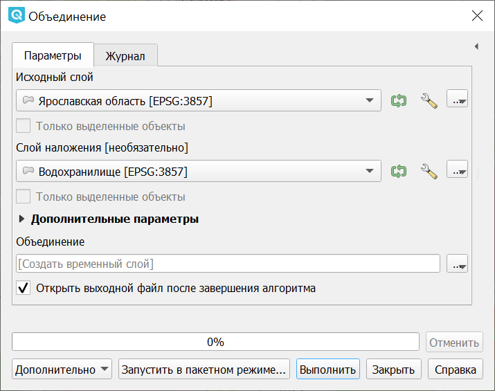

   Инструмент для работы с векторными данными - Объединение

Совмещает слои таким образом, что в выходном слое содержатся как участки пересечения, 
так и участки, принадлежащие только одному из слоев. Создаёт новый Shapefile.

.. figure:: _static/vectortools_union.png
   :align: center
   :height: 7cm

   Результат объединения Рыбинского водохранилища и Ярославской области - территория 
   и области, и всего водохранилища. 
   
.. http://trolleway.nextgis.com/api/component/render/image?resource=553,554,473&extent=3997962.3274278585,7692622.5266201375,5069303.715872889,8220955.266127276&size=877,433

.. _ngq_vector_op_clip:

Обрезать
^^^^^^^^^^^^^^^^^^^^^^^^^^^^^^^^^^^^^^^

Операция запускается из панели Инструменты анализа (раздел "Инструменты пространственных операций") или через пункт меню Вектор ‣ Геообработка ‣ Обрезать:

   Инструмент для работы с векторными данными - Обрезка

Совмещает слои таким образом, что в выходном слое содержатся только те участки, 
которые пересекаются со слоем отсечения.

Создаёт новый слой.

.. figure:: _static/vectortools_clip.png
   :align: center
   :height: 7cm

   Результат обрезки. 
 
.. http://trolleway.nextgis.com/api/component/render/image?resource=553,554,467&extent=3997962.3274278585,7692622.5266201375,5069303.715872889,8220955.266127276&size=877,433

Инструмент в результирующем слое создаёт атрибуты только из исходного слоя. 

.. _ngq_vector_op_difference:

Разность
^^^^^^^^^^^^^^^^^^^^^^^^^^^^^^^^^^^^^^^

Операция запускается из панели Инструменты анализа (раздел "Инструменты пространственных операций") или через пункт меню Вектор ‣ Геообработка ‣ Разность:

   Инструмент для работы с векторными данными - Разность

Совмещает слои таким образом, что в выходном слое содержатся только те участки, 
которые **не** пересекаются со слоем отсечения. Создаёт новый слой.

.. figure:: _static/vectortools_difference.png
   :align: center
   :height: 7cm
   
   Результат разности
   
.. http://trolleway.nextgis.com/api/component/render/image?resource=553,554,475&extent=3997962.3274278585,7692622.5266201375,5069303.715872889,8220955.266127276&size=877,433

.. _ngq_vector_op_symmdifference:

Симметричная разность
^^^^^^^^^^^^^^^^^^^^^^^^^^^^^^^^^^^^^^^

Операция запускается из панели Инструменты анализа (раздел "Инструменты пространственных операций") или через пункт меню Вектор ‣ Геообработка ‣ Симметричная разность:

   Инструмент для работы с векторными данными - Симметричная разность

Совмещает слои таким образом, что в выходном слое содержатся только те участки, 
в которых исходные слои не пересекаются. Создаёт новый слой.

.. figure:: _static/vectortools_symmetrical_difference.png
   :align: center
   :height: 7cm
   
   Результат симметричной разности
   
.. http://trolleway.nextgis.com/api/component/render/image?resource=553,554,477&extent=3997962.3274278585,7692622.5266201375,5069303.715872889,8220955.266127276&size=877,433

.. _ngq_vector_op_dissolve:

Объединение по признаку
^^^^^^^^^^^^^^^^^^^^^^^^^^^^^^^^^^^^^^^

Операция запускается из панели Инструменты анализа (раздел "Вектор - Геометрия") или через пункт меню Вектор ‣ Геообработка ‣ Объединение по признаку:

   Инструмент для работы с векторными данными - Объединение по признаку

Объединяет объекты на основе значения указанного поля. Все объекты исходного слоя быть могут объединены в один. Или может быть задан один или несколько атрибутов классификации (класс - объекты с одинаковым значением атрибута) - все объекты с одинаковым значением поля будут объединены в один объект.

Создаёт новый слой.

Выходные геометрии становятся составными (мультигеометрии). В случае полигонального слоя - смежные границы объединяемых объектов удаляются.

.. _ngq_vector_op_eliminate:

Удалить выбранные полигоны (присоединить к соседним)
^^^^^^^^^^^^^^^^^^^^^^^^^^^^^^^^^^^^^^^

Операция запускается из панели Инструменты анализа (раздел "Вектор - Геометрия") или через пункт меню Вектор ‣ Геообработка ‣ Удалить выбранные полигоны (присоединить к соседним):

   Инструмент для работы с векторными данными - Удаление осколочных полигонов

Алгоритм сливает выбранные полигоны исходного слоя с некоторыми смежными полигонами путем стирания их общей границы. Смежным полигоном может быть либо полигон с наибольшей или наименьшей площадью, либо полигон, имеющий наибольшую общую границу. Алгоритм обычно используется для избавления от осколочных полигонов, т. е. крошечных полигонов, которые являются результатом пересечения полигонов, где границы входных данных похожи, но не идентичны.

Создаёт новый слой.

.. _ngq_vector_op_geometry:

Обработка геометрии
-------------------------------------

Операция запускается через пункт меню Вектор ‣ Обработка геометрии:

   
   Выпадающее меню Обработка геометрии

.. _ngq_vector_op_checkvalidity:

Проверка геометрии
^^^^^^^^^^^^^^^^^^^^^^^^^^^^^^^^^^^^^^^

Операция запускается из панели Инструменты анализа (раздел "Вектор - Геометрия") или через пункт меню Вектор ‣ Обработка геометрии ‣ Проверка геометрии:

   Инструмент для работы с векторными данными - Проверка геометрии

Проверяет полигоны на наличие пересечений, «островов» и неправильного порядка нумерации 
узлов.

Создает три слоя:

* Слой корректных объектов
* Слой некорректных объектов
* Слой ошибок

.. _ngq_vector_op_addgeometrycolums:

Добавить атрибуты геометрии
^^^^^^^^^^^^^^^^^^^^^^^^^^^^^^^^^^^^^^^^^^^^^^

Операция запускается из панели Инструменты анализа (раздел "Вектор - Геометрия") или через пункт меню Вектор ‣ Обработка геометрии ‣ Добавить атрибуты геометрии:

   Инструмент для работы с векторными данными - Добавить атрибуты геометрии

Алгоритм вычисляет геометрические свойства объектов векторного слоя. 

В результате генерируется новый векторный слой с тем же содержимым, что и исходный, но с дополнительными атрибутами в таблице, содержащими геометрические измерения.

В зависимости от типа геометрии векторного слоя атрибуты, добавляемые в таблицу, будут отличаться:

* (XCOORD, YCOORD) для точечного слоя
* (LENGTH) для линейного 
* (AREA, PERIMETER) для полигонального

По умолчанию, длины и площади будут рассчитаны в единицах координат слоя. Рекомендуем использовать для их вычисления в километрах, гектарах и т.п `Калькулятор полей <https://docs.nextgis.ru/docs_ngqgis/source/editing.html#ngqgis-editing-area-calc>`_. 

.. _ngq_vector_op_centroids:

Центроиды
^^^^^^^^^^^^^^^^^^^^^^^^^^^^^^^^^^^^^^^

Операция запускается из панели Инструменты анализа (раздел "Вектор - Геометрия") или через пункт меню Вектор ‣ Обработка геометрии ‣ Центроиды:

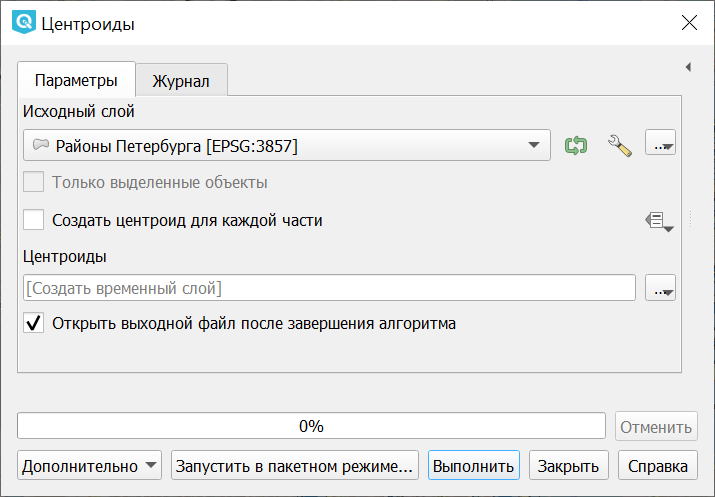

   Инструмент для работы с векторными данными - Центроиды

Вычисляет истинные центроиды для объектов исходного слоя.

Создает новый точечный слой. Атрибуты производных объектов целевого слоя наследуются от родительских объектов исходного слоя.

.. figure:: _static/vectortools_centroids.png
   :align: center
   :height: 7cm
   
   Результат генерации центроидов для 4 полигонов
   
.. http://trolleway.nextgis.com/api/component/render/image?resource=1032,1034&extent=3997962.3274278585,7692622.5266201375,5069303.715872889,8220955.266127276&size=877,433

.. _ngq_vector_op_delauneytriangulation:

Триангуляция Делоне
^^^^^^^^^^^^^^^^^^^^^^^^^^^^^^^^^^^^^^^

Операция запускается из панели Инструменты анализа (раздел "Вектор - Геометрия") или через пункт меню Вектор ‣ Обработка геометрии ‣ Триангуляция Делоне:

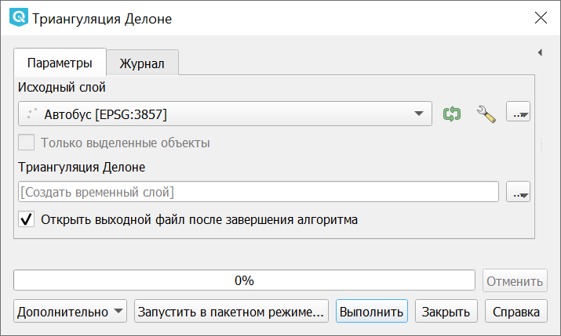

   Инструмент для работы с векторными данными - Триангуляция Делоне

Рассчитывает и строит (как полигональный слой) триангуляцию Делоне для исходного 
точечного слоя.
Создаёт новый слой.

 
   Исходный точечный слой

 
   Результат триангуляции

.. _ngq_vector_op_voronoipolygons:

Полигоны Вороного 
^^^^^^^^^^^^^^^^^^^^^^^^^^^^^^^^^^^^^^^

Операция запускается из панели Инструменты анализа (раздел "Вектор - Геометрия") или через пункт меню Вектор ‣ Обработка геометрии ‣ Полигоны Вороного:

   Инструмент для работы с векторными данными - Полигоны Вороного

Генерирует полигоны Вороного для исходного точечного слоя.
Создаёт новый слой.

 
   Исходный точечный слой

 
   Полигоны Вороного

.. _ngq_vector_op_simplify:

Упростить геометрию
^^^^^^^^^^^^^^^^^^^^^^^^^^^^^^^^^^^^^^^

Операция запускается из панели Инструменты анализа (раздел "Вектор - Геометрия") или через пункт меню Вектор ‣ Обработка геометрии ‣ Упростить:

   Инструмент для работы с векторными данными - Упростить

Упрощает линии или полигоны. В результате создается новый слой с теми же объектами, что в исходном слое, но геометрии содержат меньшее количество вершин.

Предлагается на выбор три метода упрощения:

* алгоритм Дугласа-Пекера (базирующийся на линейном допуске)
* алгоритм Висвалингама (базирующийся на площадном допуске)
* привязка геометрии к координатной сетке

.. _ngq_vector_op_densify:

Добавить вершины
^^^^^^^^^^^^^^^^^^^^^^^^^^^^^^^^^^^^^^^

Операция запускается из панели Инструменты анализа (раздел "Вектор - Геометрия") или через пункт меню Вектор ‣ Обработка геометрии ‣ Добавить вершины:

   Инструмент для работы с векторными данными - Добавить вершины

Добавляет дополнительные вершины к объектам линейного или полиногнального слоя. Число новых вершин, добавляемых в геометрии задается параметром.

Создается новый слой - версия исходного линейного или полигонального слоя с увеличенным числом вершин.

Если геометрия имеет измерения z или m, то значения в этих измерениях будут линейно интерполированы в добавленных узлах.

   
   Число добавленных вершин - 10. Вершины полигона в режиме редактирования подсвечены красным 

.. _ngq_vector_op_multitosingle:

Разбить составную геометрию
^^^^^^^^^^^^^^^^^^^^^^^^^^^^^^^^^^^^^^^

Операция запускается из панели Инструменты анализа (раздел "Вектор - Геометрия") или через пункт меню Вектор ‣ Обработка геометрии ‣ Разбить составную геометрию:

   Инструмент для работы с векторными данными - Разбить составную геометрию.

Преобразует составные объекты (мульти-полигоны или мульти-полилинии) в несколько 
простых объектов (полигонов или полилиний).

Каждый объект с составной геометрией делится на столько простых объектов, сколько частей содержит исходная геометрия, и для каждого из них используются одни и те же исходные атрибуты.

Создает новый слой.

.. _ngq_vector_op_collect:

Собрать геометрии
^^^^^^^^^^^^^^^^^^^^^^^^^^^^^^^^^^^^^^^

Операция запускается из панели Инструменты анализа (раздел "Вектор - Геометрия") или через пункт меню Вектор ‣ Обработка геометрии ‣ Собрать геометрии:

   Инструмент для работы с векторными данными - Собрать геометрии
   
Алгоритм собирает объекты векторного слоя в новый составной объект. 

Можно указать один или несколько атрибутов для сбора объектов, принадлежащих только к одному классу (имеющих одинаковое значение для указанных атрибутов), или же можно собрать все объекты.

Тип геометрии целевого объекта будет преобразован в составной тип, даже если и состоит из одного исходного объекта. 

Данный алгоритм не объединяет перекрывающиеся геометрии, в отличие от инструмента "Объединение по признаку" - они будут собраны вместе без изменения формы каждого исходного объекта.

См. алгоритмы 'Агрегировать' или 'Преобразовать в составные' как альтернативы с иными возможностями.

.. _ngq_vector_op_polytolines:

Преобразовать полигоны в линии
^^^^^^^^^^^^^^^^^^^^^^^^^^^^^^^^^^^^^^^

Операция запускается из панели Инструменты анализа (раздел "Вектор - Геометрия") или через пункт меню Вектор ‣ Обработка геометрии ‣ Полигоны в линии:

   Инструмент для работы с векторными данными - Полигоны в линии

Преобразует полигоны в линии, составные полигоны преобразует в несколько простых 
полилиний.

.. _ngq_vector_op_linestopoly:

Преобразовать линии в полигоны
^^^^^^^^^^^^^^^^^^^^^^^^^^^^^^^^^^^^^^^

Операция запускается из панели Инструменты анализа (раздел "Вектор - Геометрия") или через пункт меню Вектор ‣ Обработка геометрии ‣ Линии в полигоны:

   Инструмент для работы с векторными данными - Линии в полигоны

Преобразует линии в полигоны, составные линии преобразует в несколько простых полигонов.

Создаёт новый слой. Таблица атрибутов копируется в выходной слой без изменений.

.. _ngq_vector_op_extractvertices:

Извлечь вершины
^^^^^^^^^^^^^^^^^^^^^^^^^^^^^^^^^^^^^^^

Операция запускается из панели Инструменты анализа (раздел "Вектор - Геометрия") или через пункт меню Вектор ‣ Обработка геометрии ‣ Извлечь вершины:

   Инструмент для работы с векторными данными - Извлечь вершины

Извлекает узлы из линий или полигонов, создавая точечный слой.

Атрибуты точек наследуются от родительских объектов исходного слоя.

К точке добавляются дополнительные поля, содержащие индекс вершины (начиная с 0), часть, которой принадлежит вершина и ее индекс внутри части (или контура в случае полигонов), расстояние вдоль исходной геометрии и угол при вершине.

.. _ngq_vector_op_data_manage:

Общие инструменты для работы с векторами
---------------------------------------------

Операция запускается через пункт меню Вектор ‣ Управление данными.

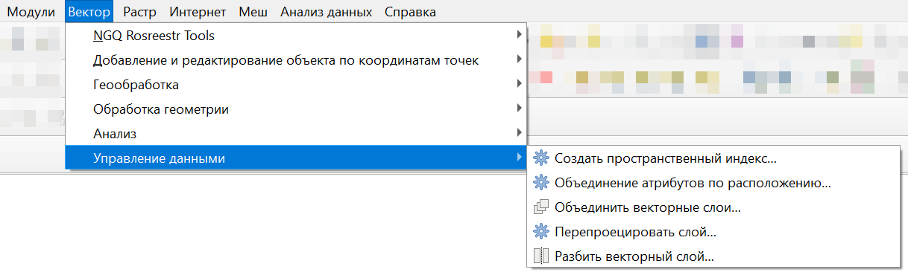
   
   Выпадающее меню Управление данными

.. _ngq_vector_op_spacialindex:

Создать пространственный индекс
^^^^^^^^^^^^^^^^^^^^^^^^^^^^^^^^^^^^^^^

Операция запускается из панели Инструменты анализа (раздел "Общие инструменты векторных данных") или через пункт меню Вектор ‣ Управление данными ‣ Создать пространственный индекс:

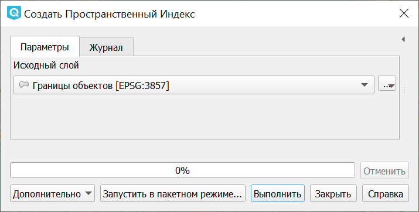

   Инструмент для работы с векторными данными - Создать пространственный индекс

Создает индекс для ускорения доступа к объектам слоя по их пространственному расположению. 

Поддержка создания пространственных индексов зависит от источника данных слоя. Работает для форматов, поддерживаемых OGR. Он сохраняется посредством OGR.

.. _ngq_vector_op_joinattrbylocation:

Объединение атрибутов по расположению
^^^^^^^^^^^^^^^^^^^^^^^^^^^^^^^^^^^^^^^

Операция запускается из панели Инструменты анализа (раздел "Общие инструменты векторных данных") или через пункт меню Вектор ‣ Управление данными ‣ Объединение атрибутов по расположению

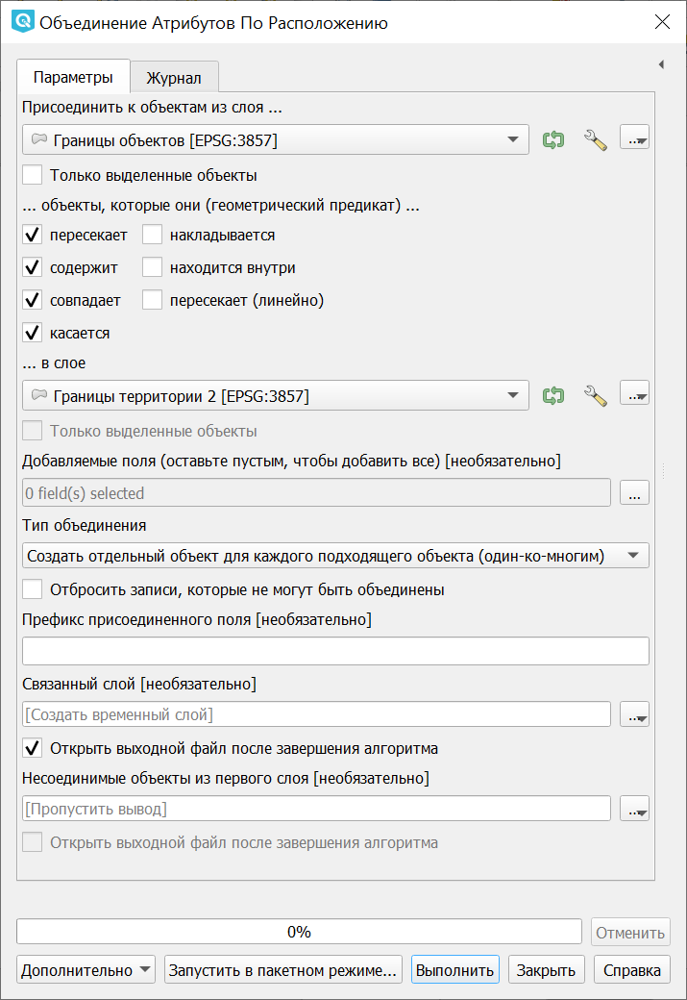

   Инструмент для работы с векторными данными - Объединение атрибутов по районам.

Алгоритм создает новый векторный слой из исходного слоя с дополнительными полями в таблице атрибутов.
Эти поля и их значения берутся из второго векторного слоя, из объектов, подходящих по пространственному критерию к объектам исходного слоя.

Можно выбрать один из вариантов соотнесения объектов:

* Создать отдельный объект для каждого подходящего объекта (один-ко-многим)
* Использовать атрибуты только первого подходящего объекта (один-к-одному)
* Взять атрибуты объекта с наибольшим наложением (один-к-одному)

.. _ngq_vector_op_mergevectorlayers:

Объединить векторные слои
^^^^^^^^^^^^^^^^^^^^^^^^^^^^^^^^^^^^^^^

Операция запускается из панели Инструменты анализа (раздел "Общие инструменты векторных данных") или через пункт меню Вектор ‣ Управление данными ‣ Объединить векторные слои:

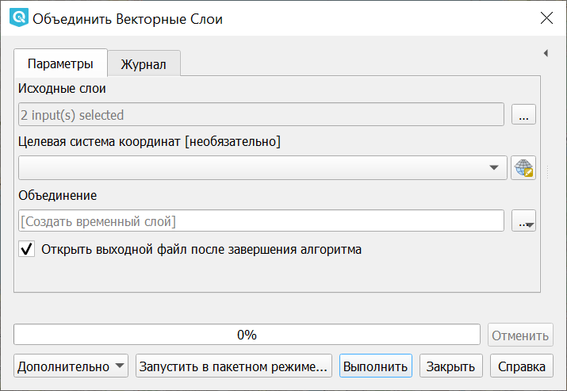

   Инструмент для работы с векторными данными - Объединить векторные слои

Объединяет несколько векторных слоёв с однотипной геометрией в один (можно выбирать больше двух).

Таблица атрибутов результирующего слоя будет содержать поля из всех исходных слоев. В случае совпадения имен полей с различным типом тип результирующего поля будет строковым. Также будет добавлены поля, содержащие имена слоев и источников.

Если какой-нибудь из исходных слоев содержит измерение Z или M, то результирующий слой также будет с этими значениями. Так и если геометрия какого-то исходного слоя будет составной, то и результат будет таковым.

Кроме того, можно установить целевую систему координат. Если нет явного указания, то система координат будет взята из первого исходного слоя. Все исходные слои будут перепроецированы в эту СК.

.. _ngq_vector_op_splitvectorlayer:

Разбить векторный слой
^^^^^^^^^^^^^^^^^^^^^^^^^^^^^^^^^^^^^^^

Операция запускается из панели Инструменты анализа (раздел "Общие инструменты векторных данных") или через пункт меню Вектор ‣ Управление данными ‣ Разбить векторный слой:

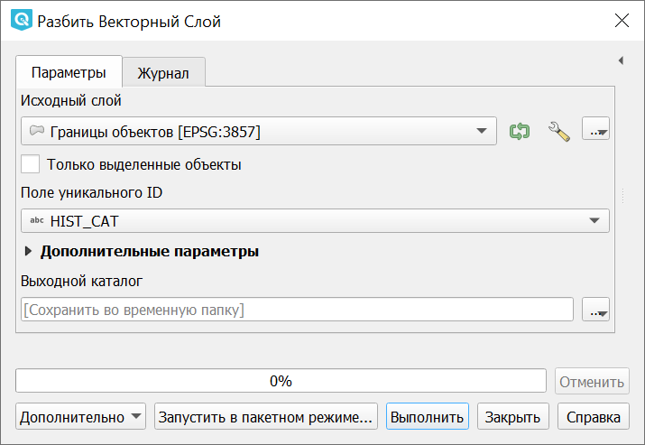

   Инструмент для работы с векторными данными - Разбить векторный слой

Делит векторный слой на несколько отдельных слоев на основе значения указанного 
поля и сохраняет полученные слои в выходной папке.

Количество сгенерированных файлов равно количеству уникальных значений этого атрибута.

.. _ngq_vector_op_reproject:

Перепроецировать слой
^^^^^^^^^^^^^^^^^^^^

Операция запускается из панели Инструменты анализа (раздел "Общие инструменты векторных данных") или через пункт меню Вектор ‣ Управление данными ‣ Перепроецировать слой.

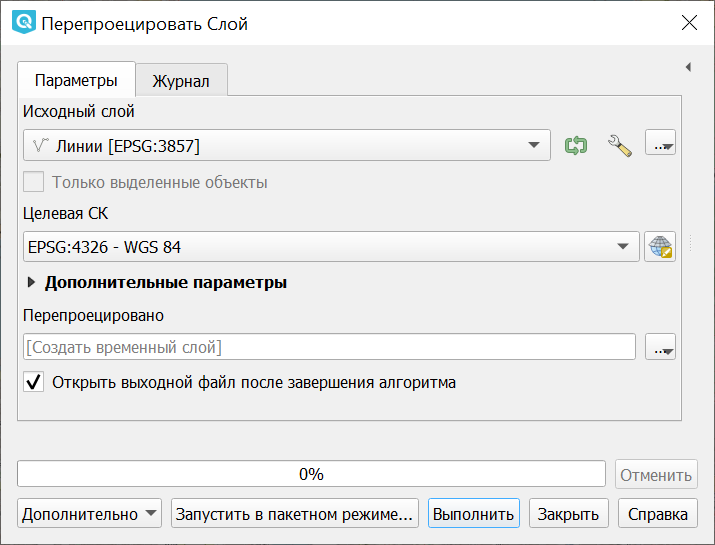

   Инструмент для работы с векторными данными - Перепроецировать слой

Алгоритм перепроецирует векторный слой. Результатом является новый слой со всем объектами исходного слоя, но с геометриями, перепроецированными в другую систему координат.

Атрибуты объектов не изменяются.

.. _ngq_vector_op_defineprojection:

Задать проекцию слоя
^^^^^^^^^^^^^^^^^^^^^^^^^^^^^^^^^^^^^^^

Операция запускается из панели Инструменты анализа (раздел "Общие инструменты векторных данных"):

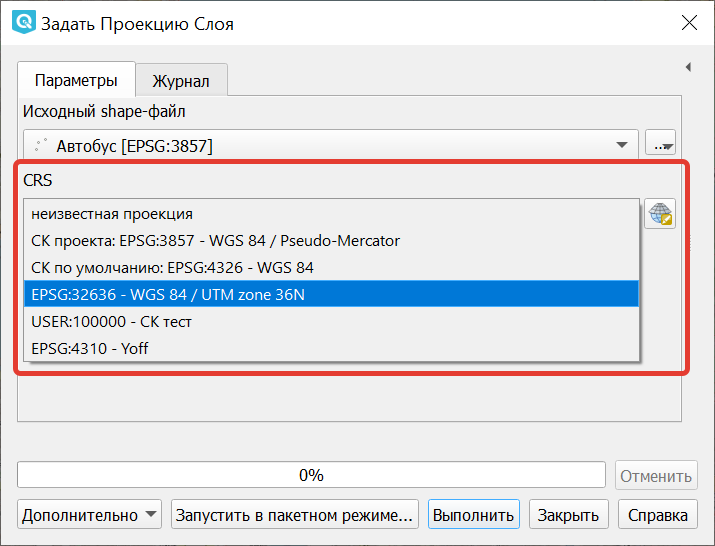

   Инструмент для работы с векторными данными - Задать проекцию слоя

Задает проекцию для шейп-файла, если ранее она не была задана.

В отличие от алгоритма "Назначить проекцию" новый слой не создается.

Для шейп-файлов файлы .prj и.qpj будут перезаписаны или созданы, если они отсутствуют, в соответствии с указанной СК.

.. _ngq_vector_op_pixelstopoints:

Пиксели в точки
^^^^^^^^^^^^^^^^^^^^^^^^^^^^^^^^^^^^^^^^^

Операция запускается через панель Инструменты анализа в разделе "Вектор - создание":

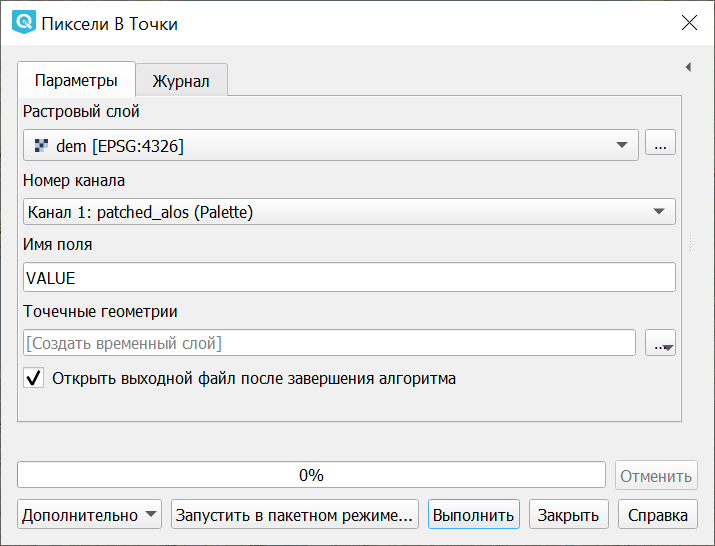
   
   Инструмент для работы с векторными данными - Пиксели в точки

Принимает на вход растр, генерирует векторный слой с точками в центре пикселов растра. 

Пиксели со значением NODATA пропускаются.

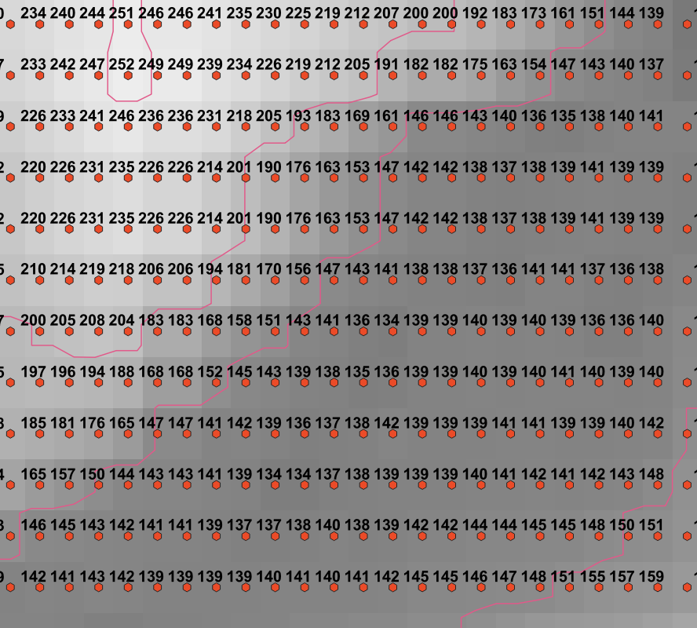

   Слой, сгенерированый инструментом пикселы в точки

.. _ngq_vector_op_pixelstopoly:

Пиксели в полигоны
^^^^^^^^^^^^^^^^^^^

Операция запускается через панель Инструменты анализа в разделе "Вектор - создание":

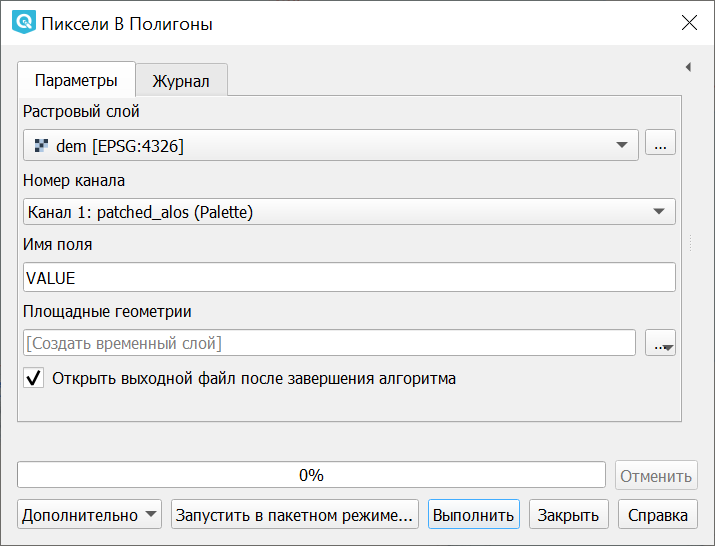
   
   Инструмент для работы с векторными данными - Пиксели в полигоны

Алгоритм преобразует растровый слой в векторный, создавая для каждого пиксела отдельный прямоугольник размером в его охват.

Пикселы со значением NODATA пропускаются.

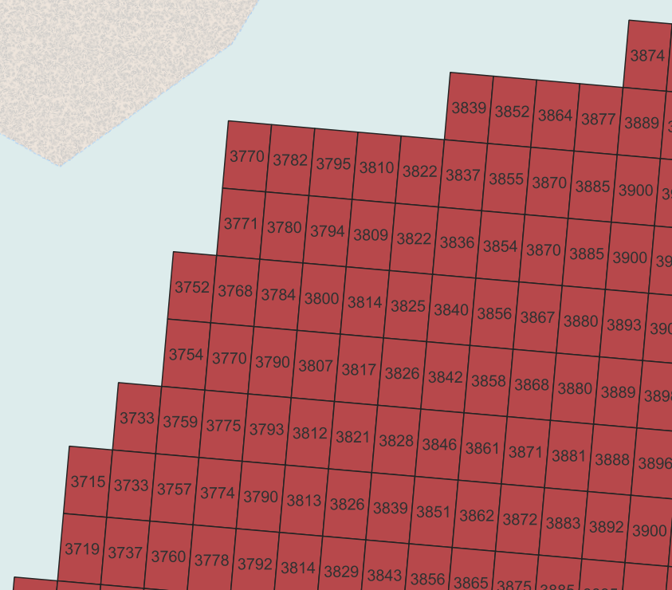

   Слой, сгенерированый инструментом пикселы в полигоны
   

.. _ngq_vector_op_minboundingbox:

Повернутая минимальная граничная рамка
^^^^^^^^^^^^^^^^^^^^^^^^^^^^^^^^^^^^^^^^^^^

Операция запускается через панель Инструменты анализа в разделе "Вектор - геометрия"

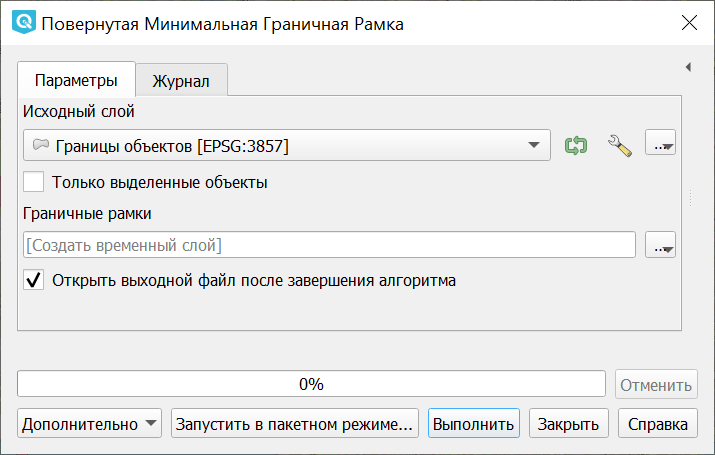
   
   Повернутая минимальная граничная рамка

Для каждого обьекта строит охватывающий прямоугольник, который повёрнут так, чтобы 
получалась меньшая площадь. В атрибуты записываются: 

* площадь,
* угол,
* периметр,
* длина,
* ширина.

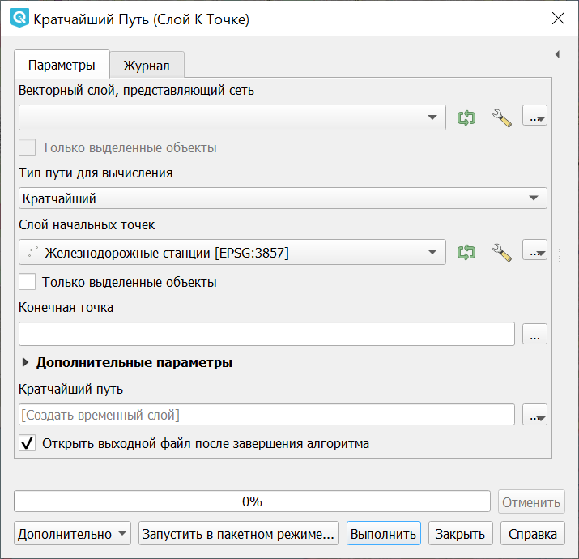

   Ориентированные охватывающие прямоугольники, построенные для слоя территорий городов

См. алгоритм 'Минимальная ограничивающая геометрия' для расчета ориентированной минимальной граничной рамки для всего слоя или сгруппированных подмножеств объектов.

.. _ngq_vector_op_network:

Сетевой анализ
-------------------------------

Операции запускаются через панель Инструменты анализа в разделе "Сетевой анализ".

.. _ngq_vector_op_shortestpath:

Кратчайший путь 
^^^^^^^^^^^^^^^^^^^^^^

Эта группа инструментов позволяет вычислить кратчайший путь между выбранными точками. 

Точки можно выбрать на карте или задать координатами. Также можно задать множество начальных или конечных точек при помощи векторного слоя.

   
   Кратчайший путь (слой к точке). Начальные точки заданы точечным слоем

.. _ngq_vector_op_servicearea:

Область обслуживания
^^^^^^^^^^^^^^^^^^^^^^^^

Задаётся линейный слой, представляющий граф, и точечный слой (операция "из слоя") или точка на карте (операция "из точки"). Инструмент создаёт линейный слой, который состоит из тех линий, что находятся в пределах заданного расстояния или времени по графу. 

Можно выбрать режим расчёта: по времени или по дистанции, максимальное значение задаётся в поле "Стоимость". Так же можно указывать, из каких атрибутов берётся направление и скорость для участка графа.

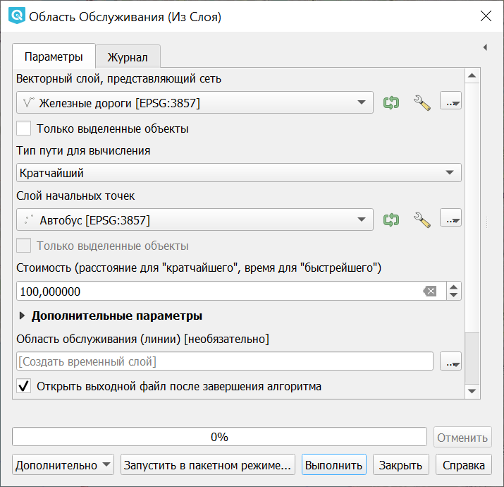
   
   Область обслуживания (из слоя)

Инструмент нормально работает, если слои в метрах (UTM). Точки не обязательно должны прилипать к дороге.

.. figure:: _static/vectortools_service_area.png
   :align: center
   :name: serviceareafromlayer_ex_pic
   :width: 16cm

   Слой сгенерированый инструментом Область обслуживания
   
