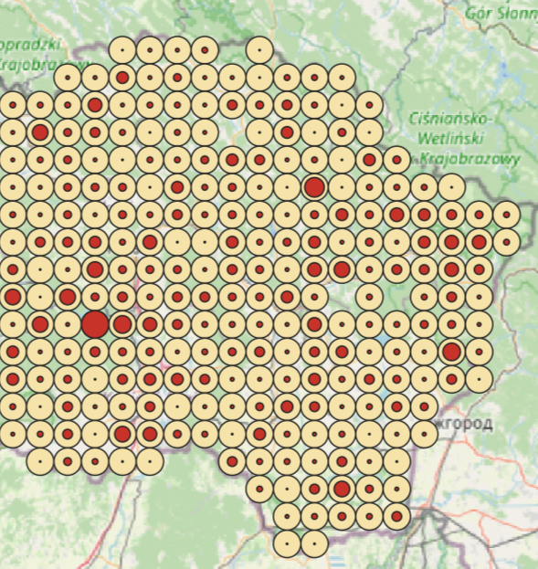
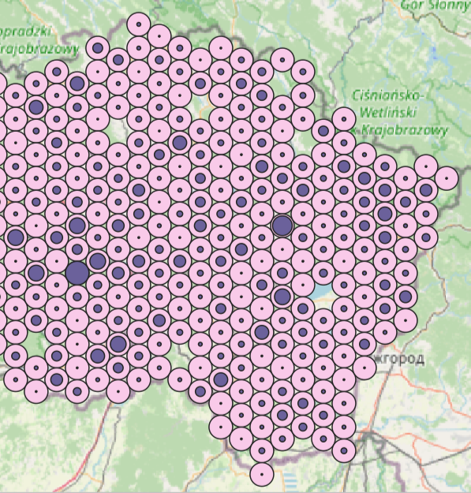

Wurman Dots
==============

Создавайте точки Вурмана по квадратной или гексагональной сетке.

Точки Вурмана – один из способов отображения плотности точечного слоя. Территория делится на ячейки, каждая из которых обозначается кружком. Заполненность кружка показывает количество точек в ячейке, полностью заполненный кружок соответствует максимальной плотности.

   Результат работы инструмента: квадратная сетка 10000

   Результат работы инструмента: гексагональная сетка 10000

После успешной установки модуль появится в меню Вектор.

.. to do:: _static/wurman_dots_settings_ru.png
   :name: 
   :align: center
   :width: 10cm

Настройки:

* Выберите точечный слой (только EPSG:3857) - это единственное обязательное для заполнения поля, в остальных можно оставить значения по умолчанию;
* Чтобы применить алгоритм не ко всем объектам слоя, а только к выделенным, поставьте соответствующую галочку;
* Укажите размер ячейки сетки в метрах (по умолчанию 50000);
* Выберите тип сетки (квадратная или гексагональная);
* Если хотите, чтобы в ячейках сетки, куда не попадает ни одной точки, тоже был кружок, отметьте Create contineous grid of fixed circles;
* При желании можно указать путь к выходным файлам. По умолчанию инструмент создаст временные слои.
* Если не хотите, чтобы результаты работы инструмента были добавлены на карту, снимите галочки "Открыть выходной файл после завершения алгоритма".

Фоновые кружки и кружки плотности представляют собой отдельные векторные слои. Для каждого из них можно настроить цвет, прозрачность и другие параметры стиля.
