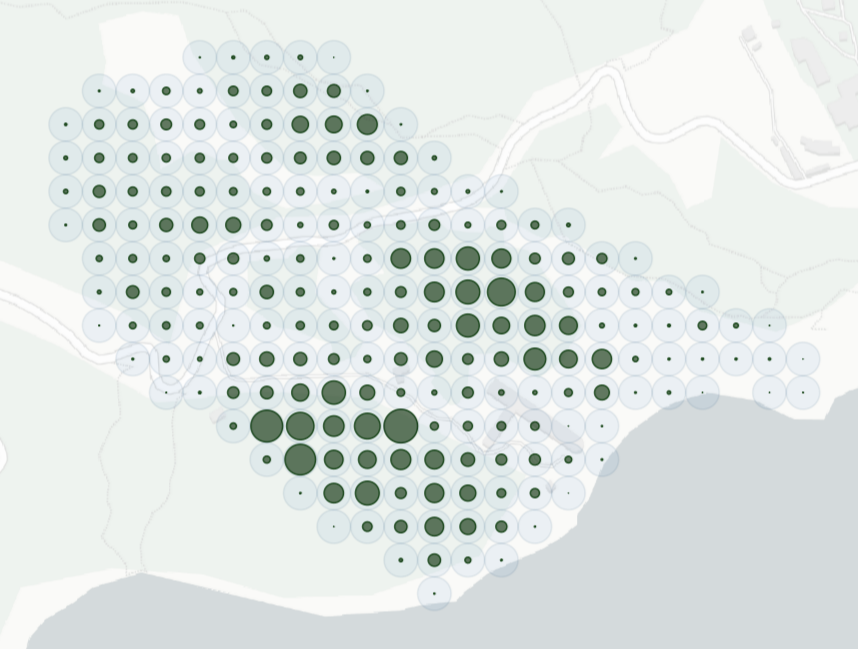
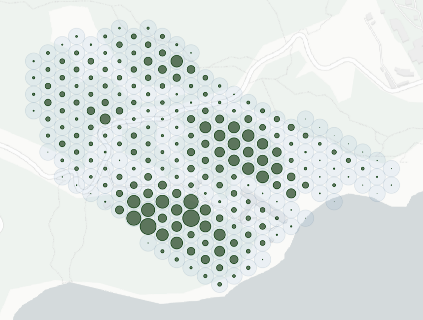
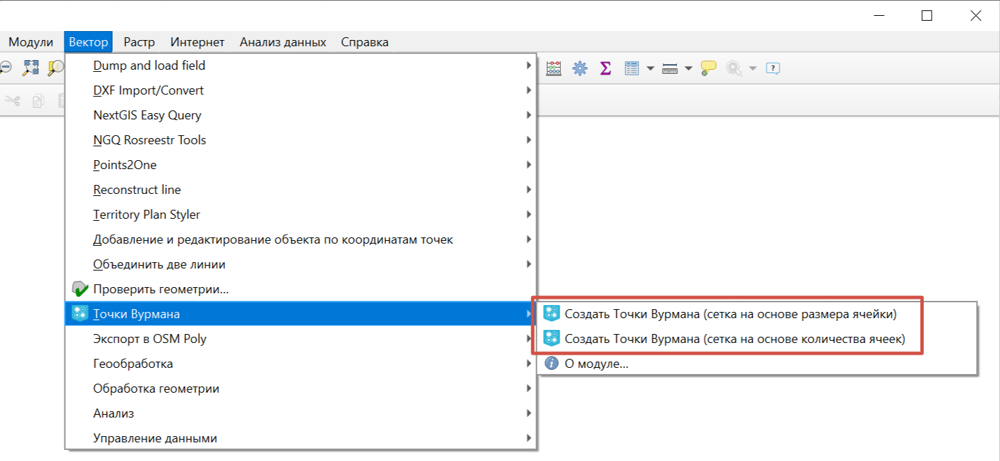
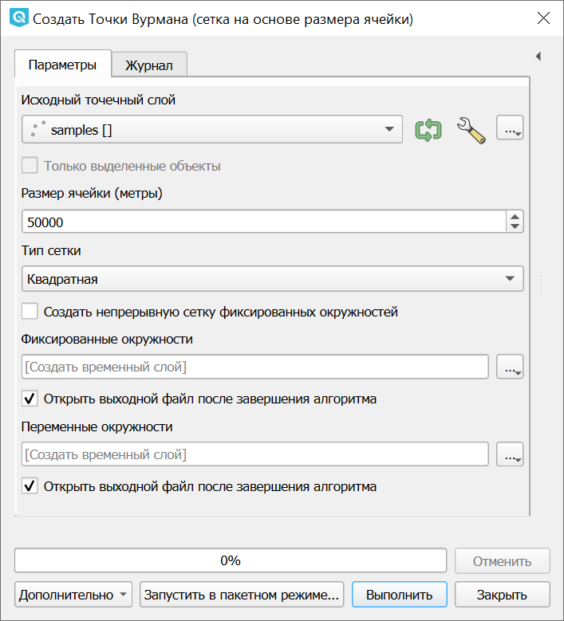
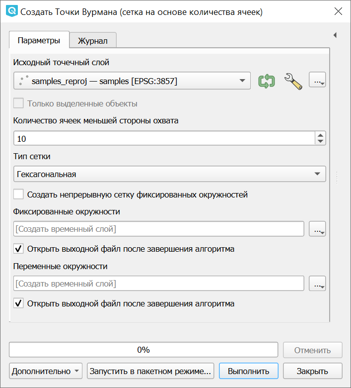

Wurman Dots
==============

.. note:: Модуль поддерживает Qt6

Создавайте точки Вурмана по квадратной или гексагональной сетке.

Точки Вурмана – один из способов отображения плотности точечного слоя. Территория делится на ячейки, каждая из которых обозначается кружком. Заполненность кружка показывает количество точек в ячейке, полностью заполненный кружок соответствует максимальной плотности.

   Результат работы инструмента: квадратная сетка 37 м

   Результат работы инструмента: гексагональная сетка 37 м

После успешной установки модуль появится в меню Вектор. В нём доступны два варианта построения сетки - на основе количества ячеек или их размера.

   Открытие модуля

Настройки:

* Выберите точечный слой (только EPSG:3857) - это единственное обязательное для заполнения поля, в остальных можно оставить значения по умолчанию;
* Чтобы применить алгоритм не ко всем объектам слоя, а только к выделенным, поставьте соответствующую галочку;
* Укажите параметры ячейки (в зависимости от выбранного вида построения):

   * размер ячейки сетки в метрах (по умолчанию 50000), ИЛИ
   * количество ячеек по меньшей стороне охвата слоя (по умолчанию 10);

* Выберите тип сетки (квадратная или гексагональная);
* Если хотите, чтобы в ячейках сетки, куда не попадает ни одной точки, тоже был кружок, отметьте Создать непрерывную сетку фиксированных окружностей;
* При желании можно указать путь к выходным файлам. По умолчанию инструмент создаст временные слои.
* Если не хотите, чтобы результаты работы инструмента были добавлены на карту, снимите галочки "Открыть выходной файл после завершения алгоритма".

   Построение сетки по размеру ячейки

   Построение сетки по количеству ячеек

Фоновые кружки и кружки плотности представляют собой отдельные векторные слои. Для каждого из них можно настроить цвет, прозрачность и другие параметры стиля.

Посмотрите на инструмент в действии в нашем видео:

.. raw:: html

   <iframe width="560" height="315" src="https://rutube.ru/play/embed/c531ceef34bbc853a4c4b6a3ec64c354/" frameBorder="0" allow="clipboard-write; autoplay" webkitAllowFullScreen mozallowfullscreen allowFullScreen></iframe>

Смотреть на `youtube <https://youtu.be/pf8FV_oHMJM>`_, `rutube <https://rutube.ru/video/c531ceef34bbc853a4c4b6a3ec64c354/>`_.
