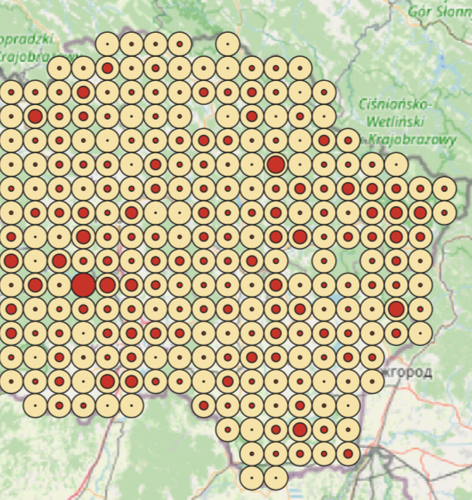
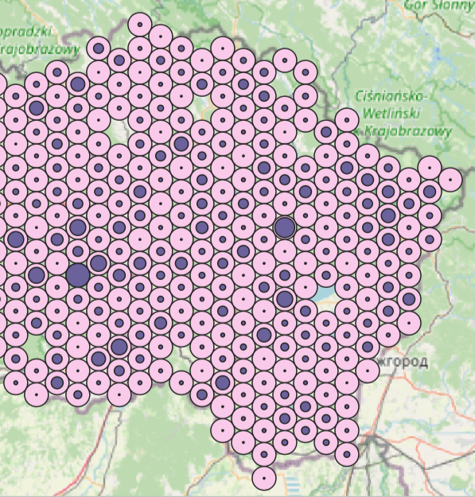
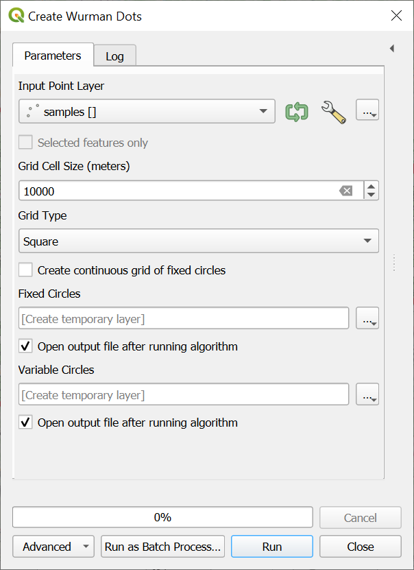

Wurman Dots
==============

Create Wurman dots using a square or hexagonal grid.

Wurman Dots is a method for visualizing the density of a point layer. The area is split into cells, each of them is then marked by a circle. The inner circle vary in size representing the density of objects within each corresponding grid cell.

   Result: square grid with 10000 m cells

   Result: hexagonal grid with 10000 m cells

After installation you can find the plugin in the Vector menu.

Settings:

* Select a point layer (EPSG:3857 only), it is the only required field, for the other fields you can use default settings;
* You can apply the algorithm to the selected features only by ticking this option;
* Set the grid cell size in meters (the default is 50000);
* Select grid type (square or hexagonal);
* If you want to create circles in the cells that have no points in them, tick "Create continuous grid of fixed circles";
* Enter paths to output files if you wish. By default, temporary layers will be created.
* If you don't want to add the resulting layers to the map, untick "Open output file after running the algorithm".

The fixed circles and density circles are separate vector layers. For each of them you can set up color, opacity and other style parameters.

See how the plugin works in our video:

.. raw:: html

   <iframe width="560" height="315" src="https://www.youtube.com/embed/5cwiV16rVGo?si=Xx46d1Y166dPEfP3" title="YouTube video player" frameborder="0" allow="accelerometer; autoplay; clipboard-write; encrypted-media; gyroscope; picture-in-picture; web-share" referrerpolicy="strict-origin-when-cross-origin" allowfullscreen></iframe>

Watch on `youtube <https://youtu.be/5cwiV16rVGo?si=uX1W4ncIu3zuIDjI>`_.
